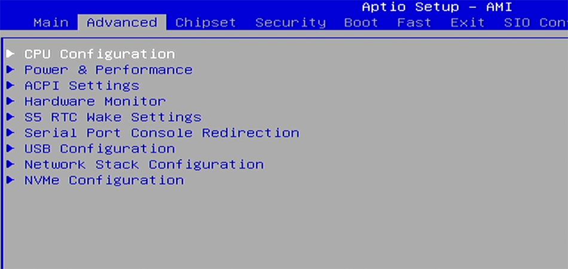
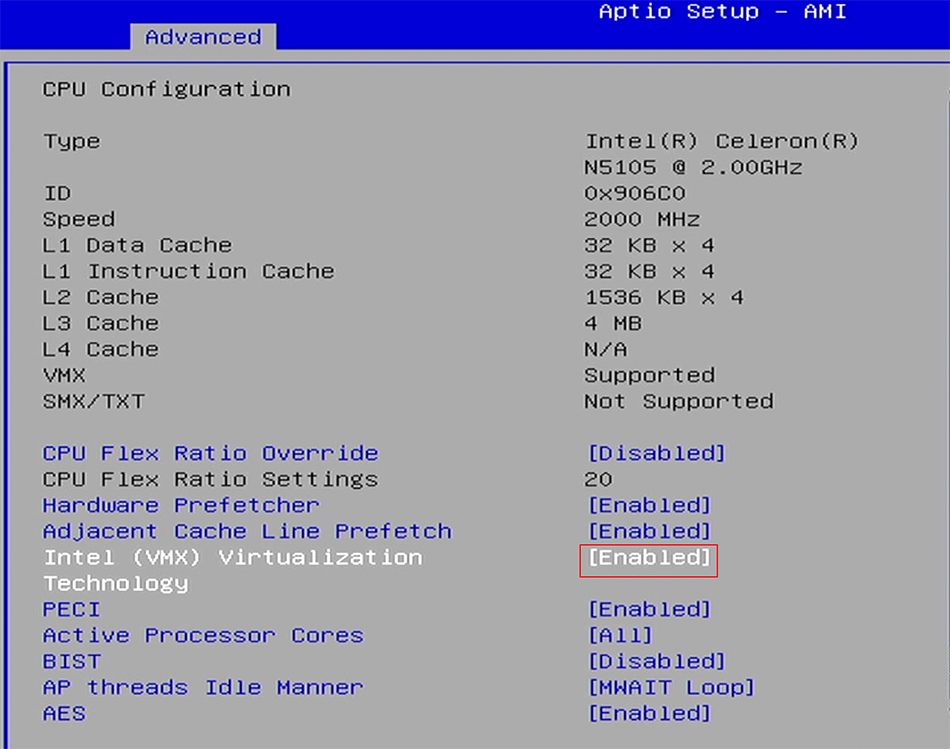
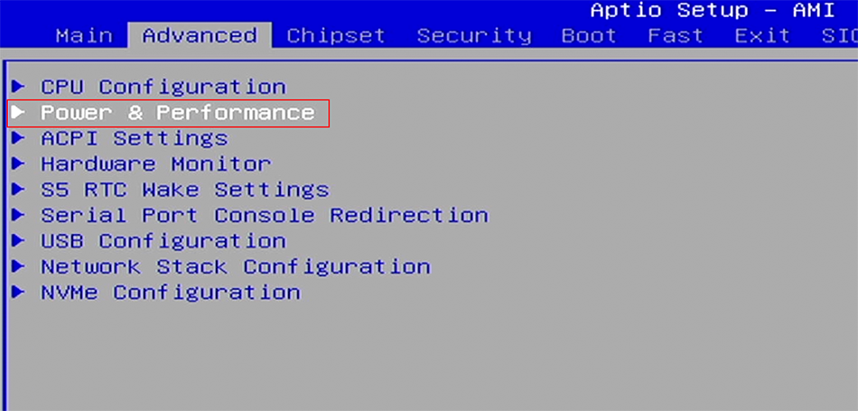
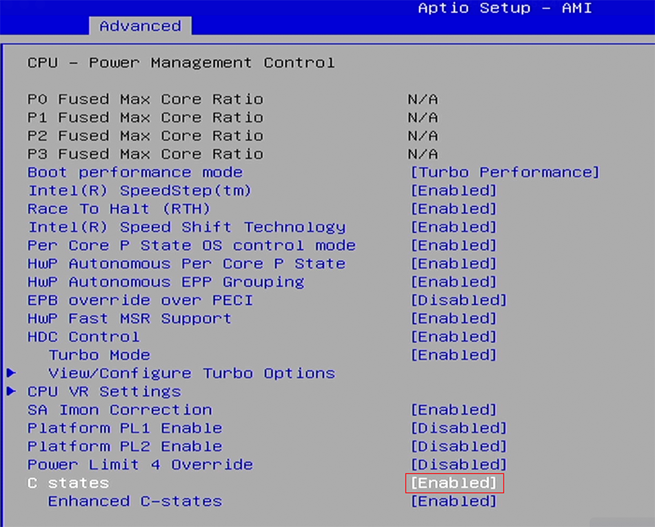
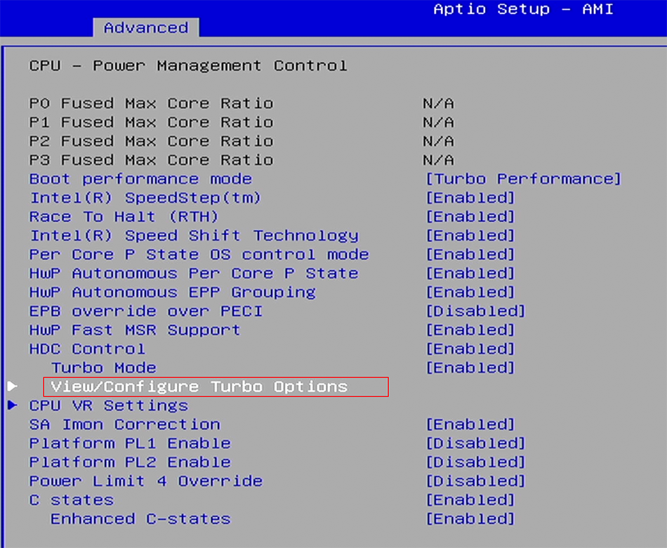
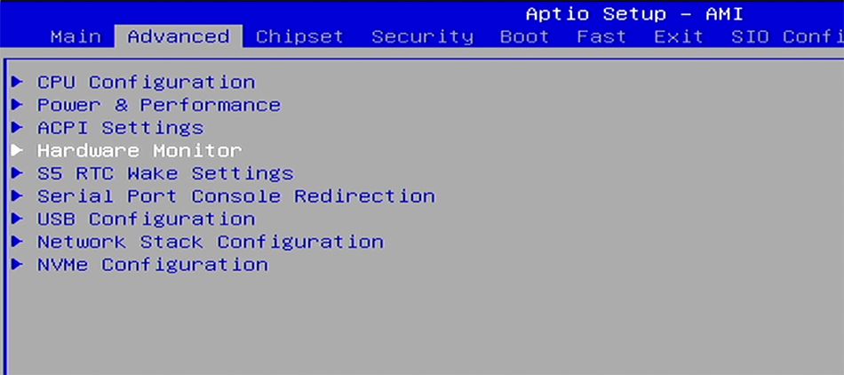
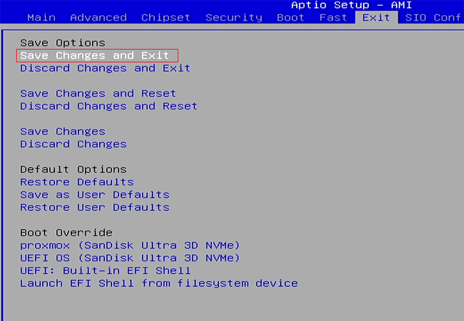
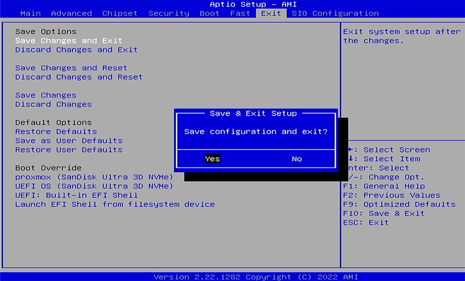

## 1.虚拟化功能确认

进入 `Advanced` 菜单的子菜单 `CPU Configuration` ：

检查 `Intel (VMX) Virtualization Technology` 选项为 `Enabled` 状态：

## 2.CPU功耗确认

进入 `Advanced` 菜单的子菜单 `Power & Performance` ：

进入 `CPU - Power Management Control` ：

检查 `C states` ， **默认** 选项为 `Enabled` 状态。  

如果遇到网卡 **无法跑满** 的情况，可以尝试将该选项关闭：

再进入 `HDC Control` 菜单的子菜单 `View/Configure Turbo Options` ：

检查以下内容，适当调整以改变功耗墙：
- `Power Limit 1 Override` 选项：`Enabled`
- `Power Limit 1` 选项：`15000`
- `Power Limit 1 Time Window` 选项：为最大 `128`

## 3.来电自启确认

进入 `Advanced` 菜单的子菜单 `Hardware Monitor` ：

确认 `Restore AC Power Loss` 选项为 `Power On` 状态：

## 4.设置快速启动

PVE 系统安装完成后，进入 `Boot` 菜单，将 `Fast Boot` 选项设置为 `Enabled` 状态：

调整系统启动顺序，将 `Proxmox` 设置为第一启动项，并关闭其他启动项内容：

最后保存 BIOS 设置 `Save Changes and Exit` ：

使用键盘左右方向键选择 `yes` 并回车键执行保存：

