## 1.虚拟化选项

进入 `Advanced` 菜单的子菜单 `CPU Configuration` ：

检查 `Intel (VMX) Virtualization Technology` 选项为 `Enabled` 状态：

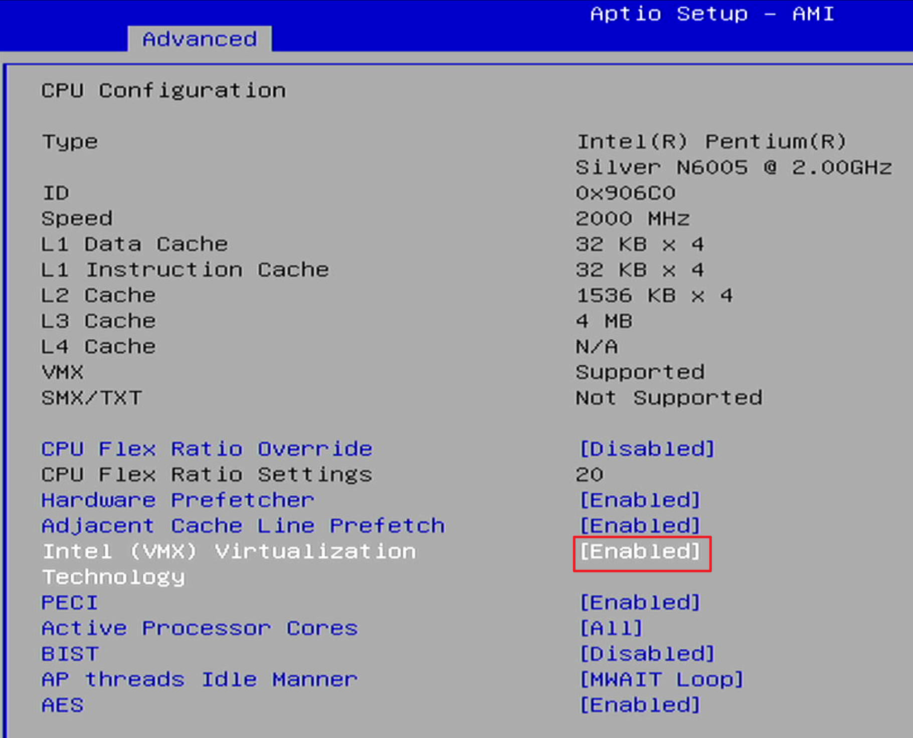

## 2. CPU 功耗

进入 `Advanced` 菜单的子菜单 `Power & Performance` ：

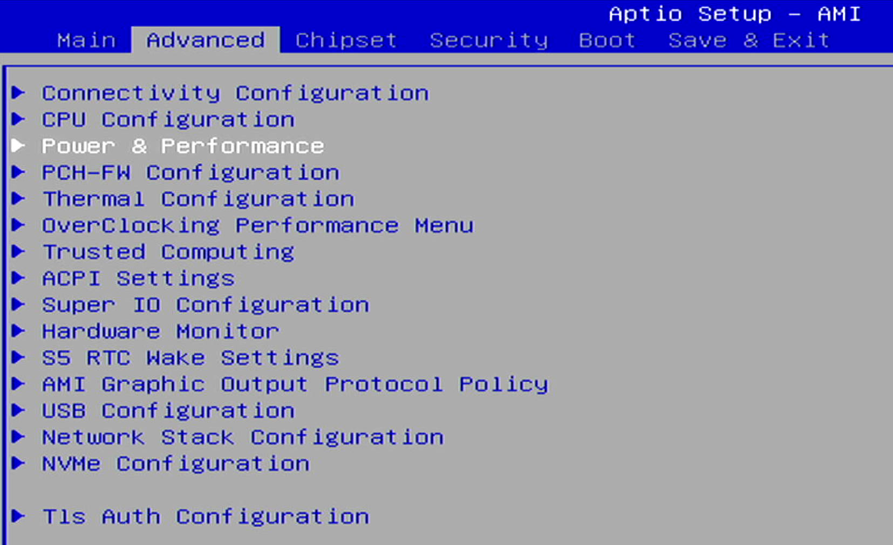

进入 `CPU - Power Management Control` ：

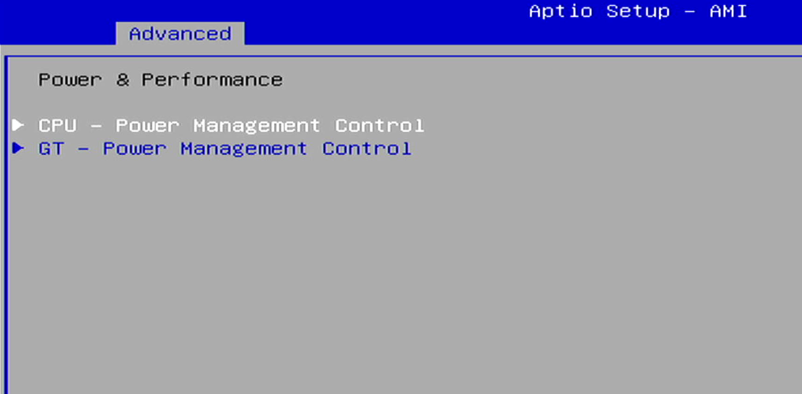

检查 `C states` ， **默认** 选项为 `Enabled` 状态，如果遇到网卡 **无法跑满** 的情况，可以尝试将该选项关闭：

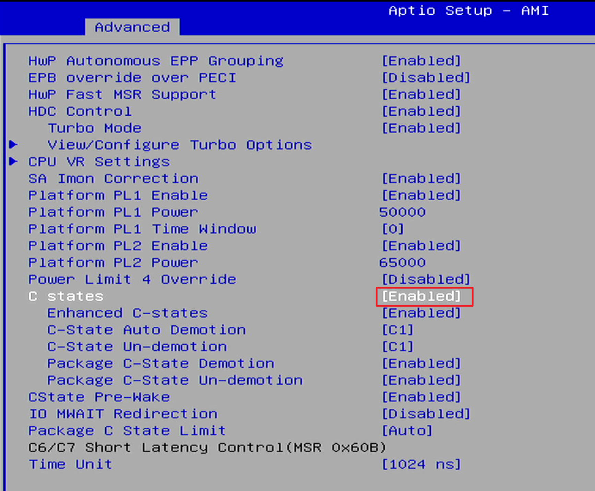

再进入 `HDC Control` 菜单的子菜单 `View/Configure Turbo Options` ：

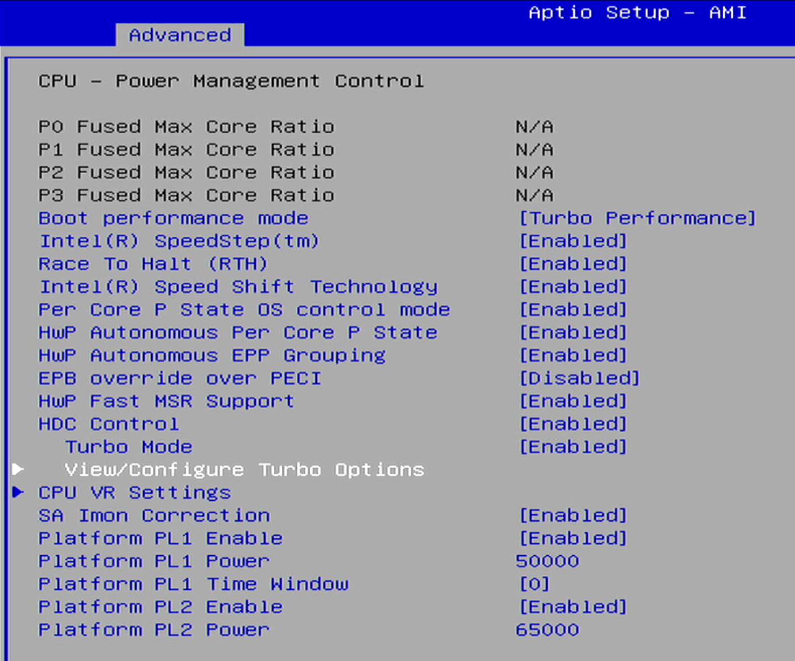

检查以下内容，适当调整以改变功耗墙：
- `Power Limit 1 Override` 选项：`Enabled`
- `Power Limit 1` 选项：`50000`
- `Power Limit 1 Time Window` 选项：为最大 `128`

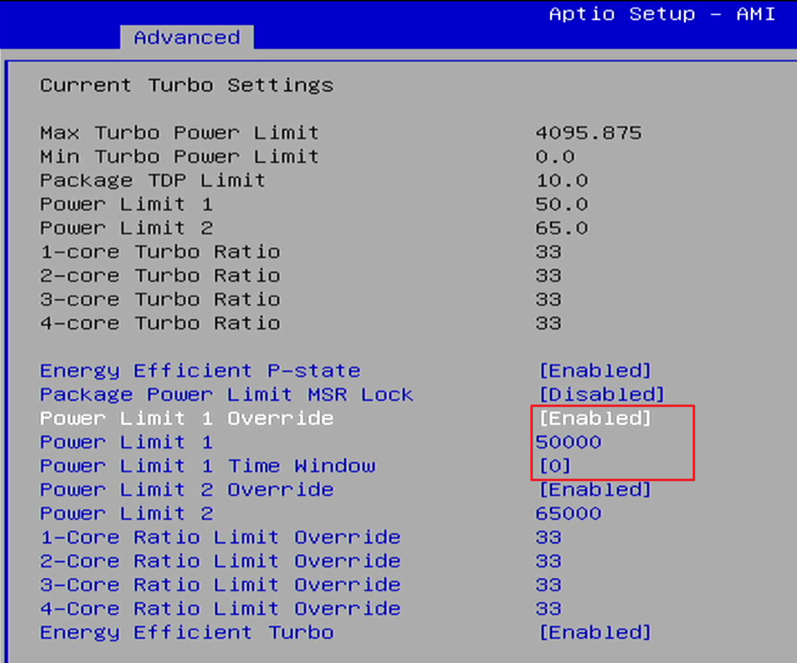

## 3.温控风扇

进入 `Advanced` 菜单的子菜单 `Hardware Monitor` ：

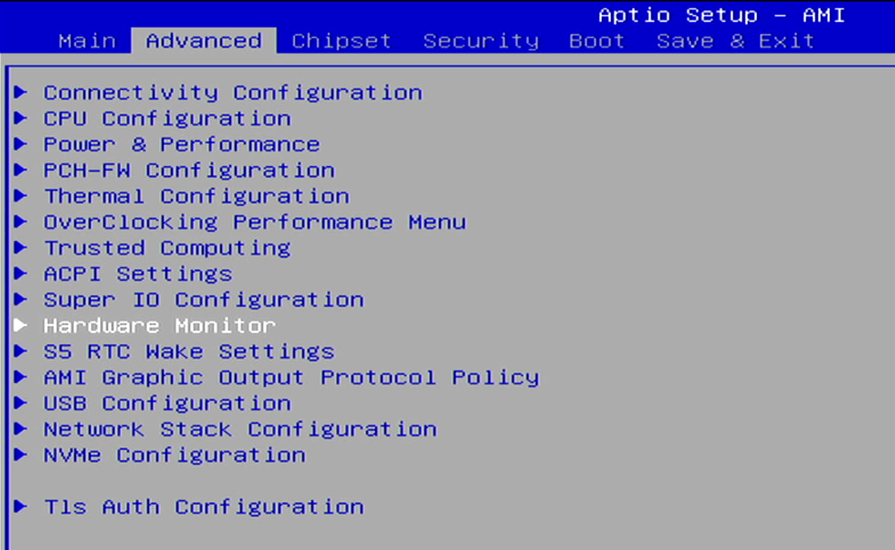

进入 `Smart Fan Function` ：  

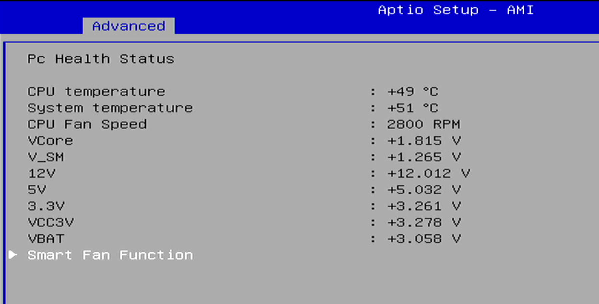

可对温控风扇参数进行调整：

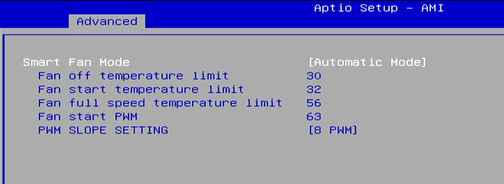

## 4.来电自启

进入 `Chipset` 菜单的子菜单 `PCH-IO Configuration` ：

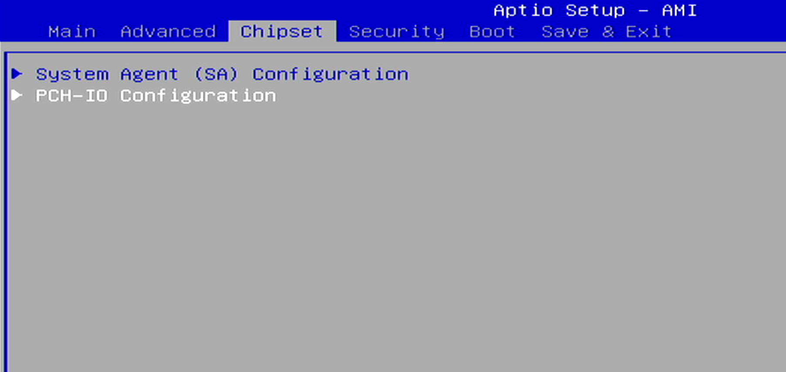

确认 `State After G3` 选项为 `Power On` 状态：

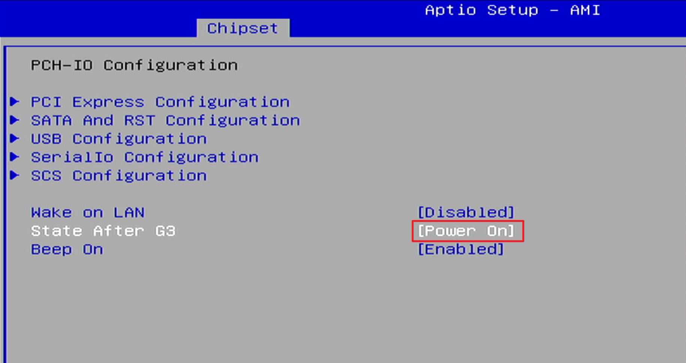

## 5.快速启动

PVE 系统安装完成后，进入 `Boot` 菜单，将 `Fast Boot` 选项设置为 `Enabled` 状态：

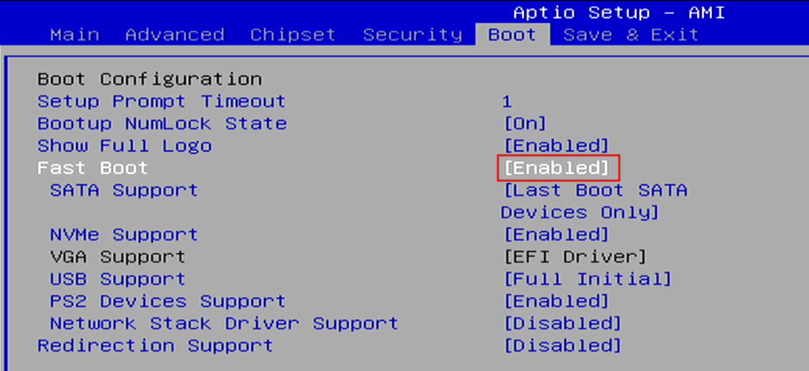

调整系统启动顺序，将 `Proxmox` 设置为第一启动项，并关闭其他启动项内容：

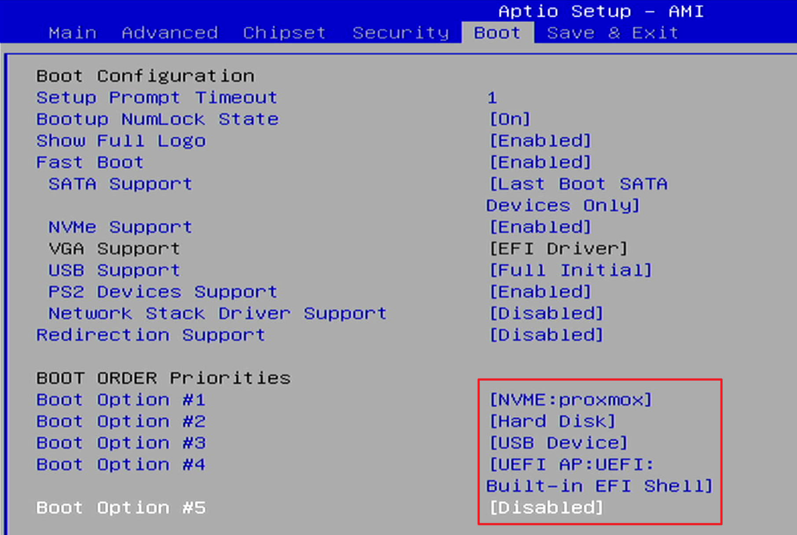

最后保存 BIOS 设置 `Save Changes and Exit` ：

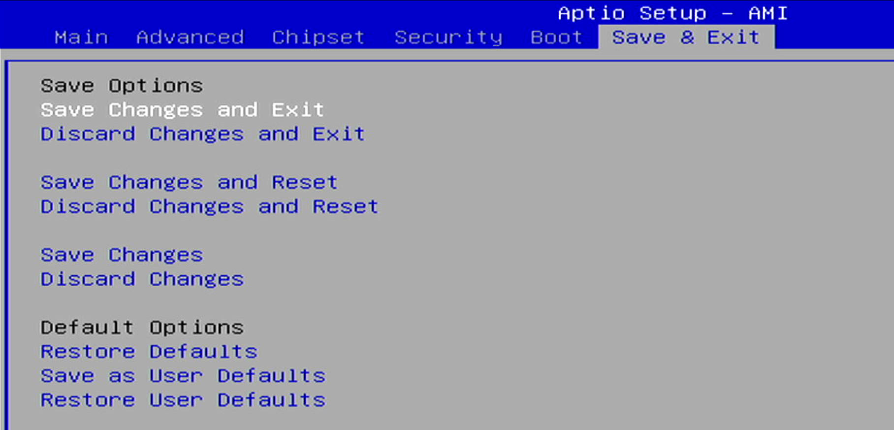

使用键盘左右方向键选择 `yes` 并回车键执行保存：

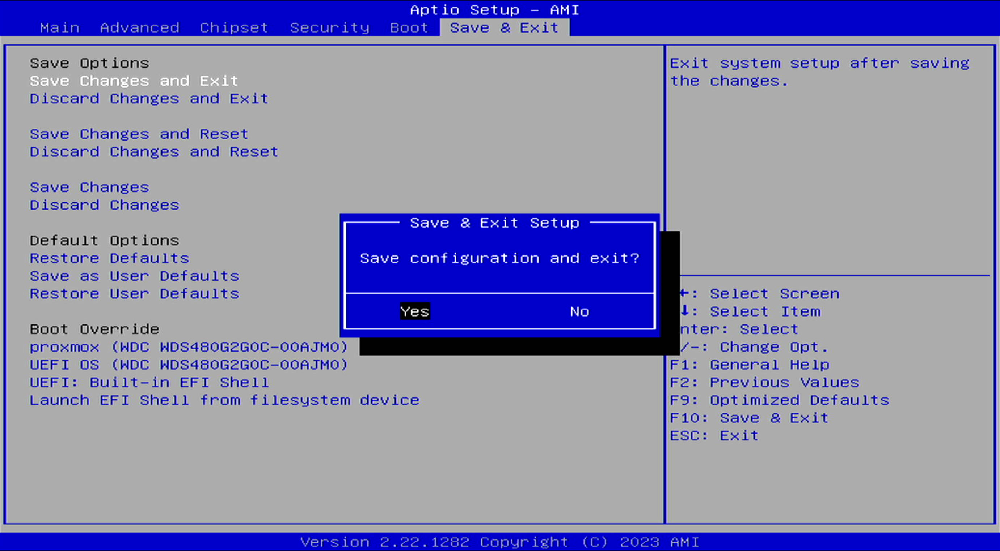