## 0.前期准备

PVE 系统正式安装之前，需要准备 PVE 的安装镜像和一些必要的配套工具。  

### 0.1. PVE 镜像下载

PVE 下载地址：[Proxmox Virtual Environment](https://www.proxmox.com/en/downloads/proxmox-virtual-environment/iso)  

页面中有多个 PVE 相关文件，本文以目前最新的 `Proxmox VE 8.3-1 ISO Installer` 作为演示。  

点击 `Proxmox VE 8.x ISO Installer` 链接，进入 PVE 下载页面。  

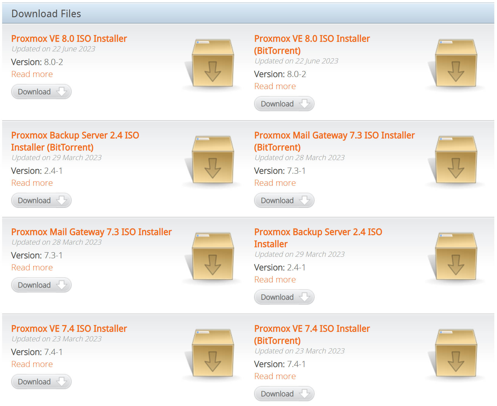

下载 ISO 时请注意 `SHA256SUM` ，后续将使用该校验信息对下载下来的 ISO 进行校验，以确保 ISO 文件的完整性。  

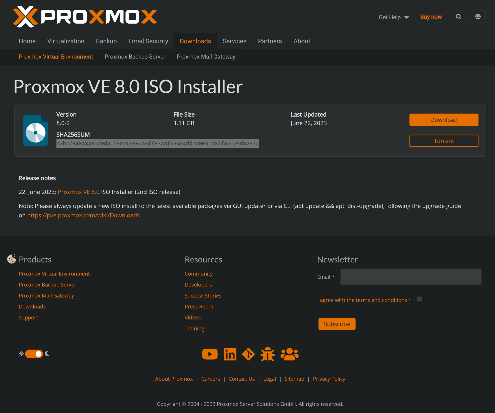

### 0.2.启动盘制作工具

考虑到制作 PVE 启动盘时，所使用的操作系统可能有 Windows 、macOS 、Linux ，因此这里推荐几个常用的写盘工具。  

#### Ventoy

官方网站地址：https://www.ventoy.net/cn/index.html  

强烈推荐的引导盘制作工具，优点是可以在一个 U 盘中放入复数个可引导的 ISO 文件。  

免去了多次格式化 U 盘再写入 ISO 文件的操作，非常友好。  

缺点是只支持 Windows 、Linux 。  

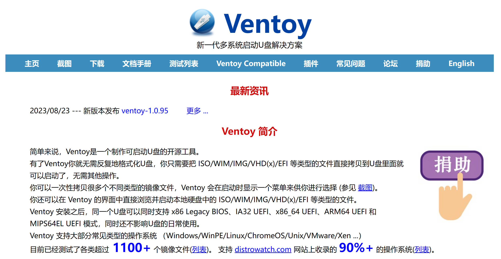

#### Etcher

官方网站地址：https://etcher.balena.io/  

跨平台的写盘工具，开源，写盘速度很快，缺点是该软件体积较大，下载缓慢。  

支持 Windows 、macOS 、Linux 。  


#### Rufus

官方网站地址：https://rufus.ie/zh/  

轻便小巧的写盘工具，仅支持 Windows 。  

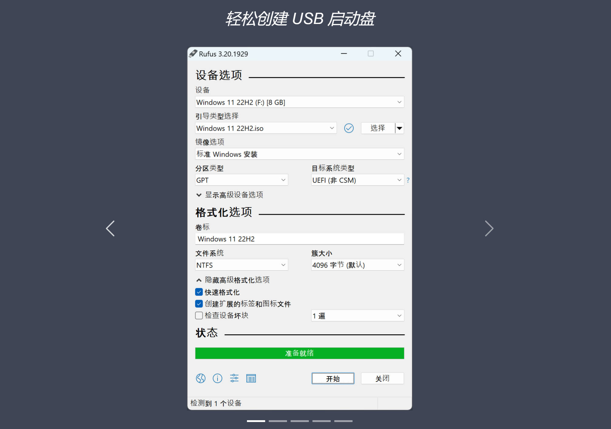

### 0.3.终端工具

考虑到配置 PVE 服务器、路由器、DNS 服务器时，需要在 CLI 中输入命令，因此这里推荐几个常用的终端工具。  

#### Windows Terminal

官方网站地址：https://aka.ms/terminal  

Microsoft 官方终端工具，可以在 Github 平台或 Microsoft 应用商店中进行下载。  

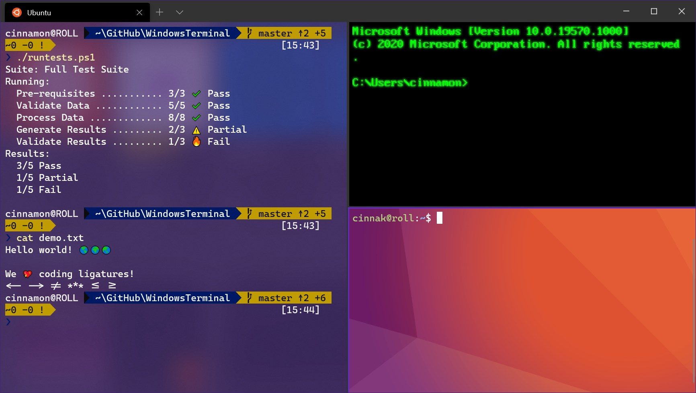

#### Termius

官方地址：https://termius.com/  

企业级终端工具，支持 Windows、macOS、Linux 系统以及移动端系统。  

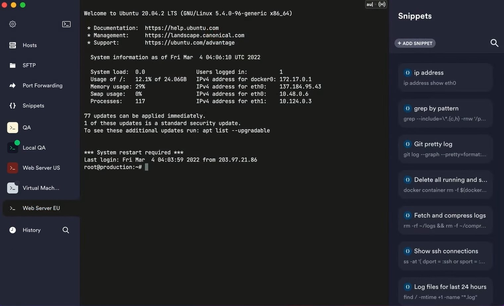

#### MobaXterm

官方地址：https://mobaxterm.mobatek.net  

功能强大的终端工具，仅支持 Windows 系统。  


## 1. PVE 系统安装

由于机型不同，BIOS 的设置也不同，所以本文不演示具体如何将机器设置成从 U 盘启动。  

在设置 BIOS 时需要注意以下几点：

- 建议暂时关闭 **安全启动**  

- 确保打开硬件虚拟化支持  

- 确保设备来电自动启动  

- 对于不支持 `UEFI` 启动的设备，检查 `Legacy` 引导模式  

- 检查 CPU 的功耗设置（可选）  

### 1.1.设备引导

使用 Ventoy 进行设备引导后，出现如下画面，选择 PVE 的安装 ISO 。  

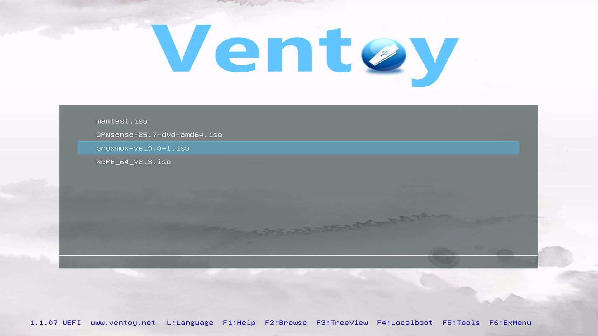

使用 `Boot in normal mode` 选项进行启动，等待引导跑码完成后，即可进入 PVE 的安装界面。  

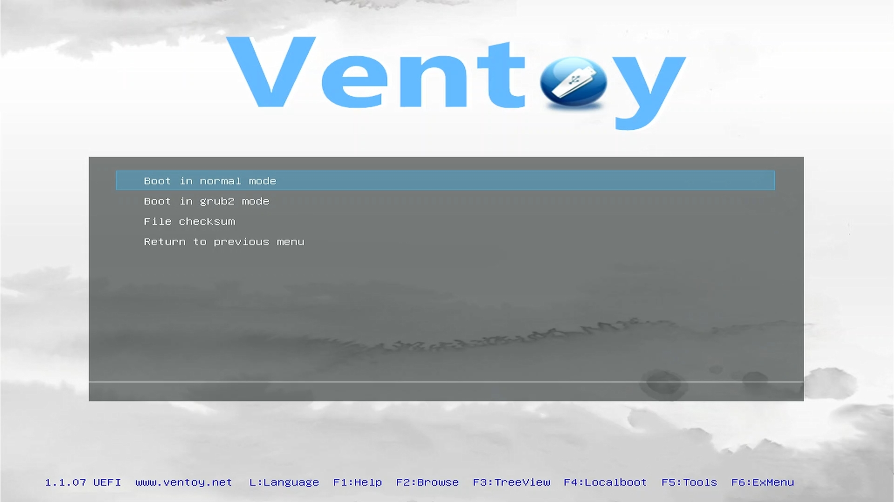

### 1.2. PVE 安装选项

新版 PVE 安装程序支持纯键盘操作，常用快捷键如下。  

|键盘按键|作用|说明|
|--|--|--|
|Esc|返回|返回上一步骤|
|Enter|确认|确认输入，激活选项或进入下一步骤|
|方向键|导航|用于选项选择，或切换输入焦点|
|Tab|导航|与方向键功能类似|
|ALT + N|下一步|进入下一步骤|

使用 `方向键` 选择第一项 `Install Proxmox VE (Graphical)` 图形化安装界面，按键盘 `Enter` 进入下一步骤。  

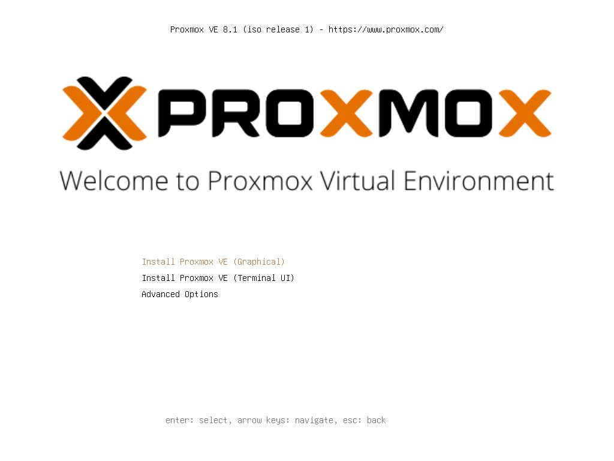

设备将继续跑码，直到出现最终用户许可协议 EULA ，按键盘组合键 `ALT + N ` 进入下一步骤。  

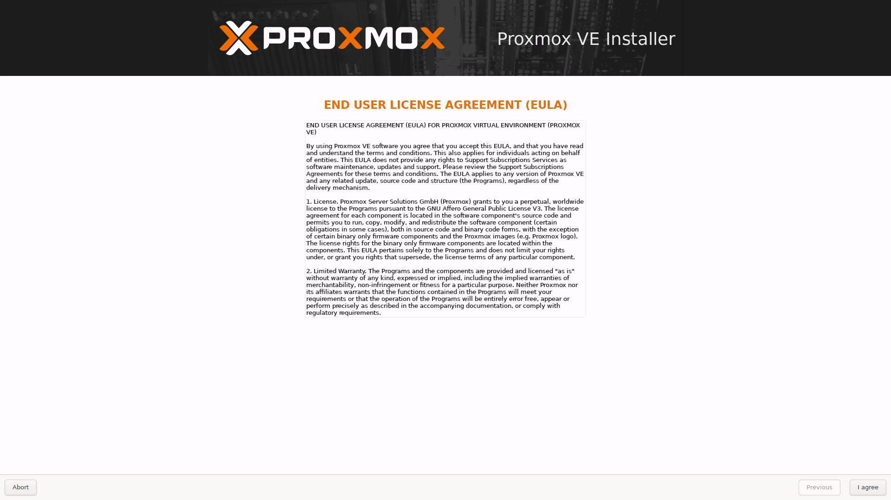

### 1.3. PVE 硬盘选项

此时会出现 `Target Harddisk` 选项，会显示出设备中存在的硬盘列表，可通过下拉框选择安装 PVE 的目标硬盘。  

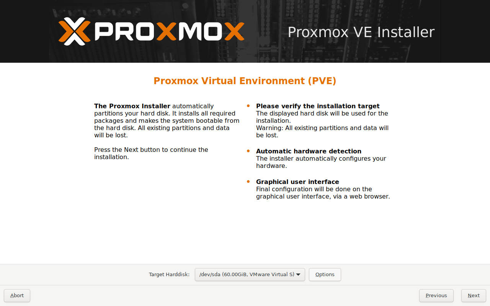

点击硬盘列表右侧的 `Options` ，对 PVE 的硬盘安装参数进行一些调整。  

推荐将 `Filesystem` 也就是硬盘的文件系统，设置成 `xfs` 。  

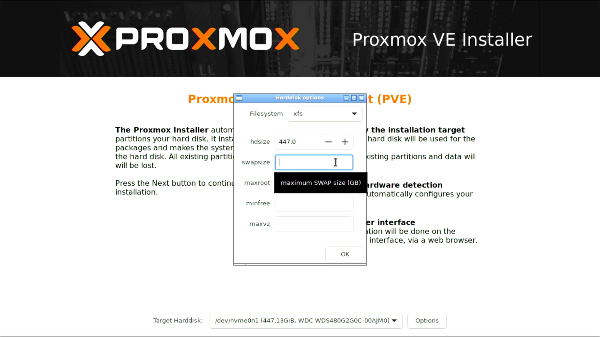

### 1.4. PVE 时区选项

此时 PVE 处于未联网的 “离线” 状态，因此不会从互联网中读取时区信息，需要手动设置时区。  

在 `Contry` 处手动输入 `China` ，下方的 `Time zone` 将自动变更为 `Asia/Shanghai` 。  


### 1.5. PVE 账户与邮箱

PVE 为最关键的虚拟化层，建议使用强密码，包含大小写字母、数字以及特殊符号。  

`Email` 必须为一个 “合法” 的邮箱地址，不然系统会判定邮箱地址不合法并拒绝继续安装。  


### 1.6. PVE 网络设置

默认情况下，PVE 会使用编号较小的第一个网口作为管理口。  

而某些设备，其物理网口顺序与该页面显示的网口顺序 **不一致** ，因此保持默认设置即可。  

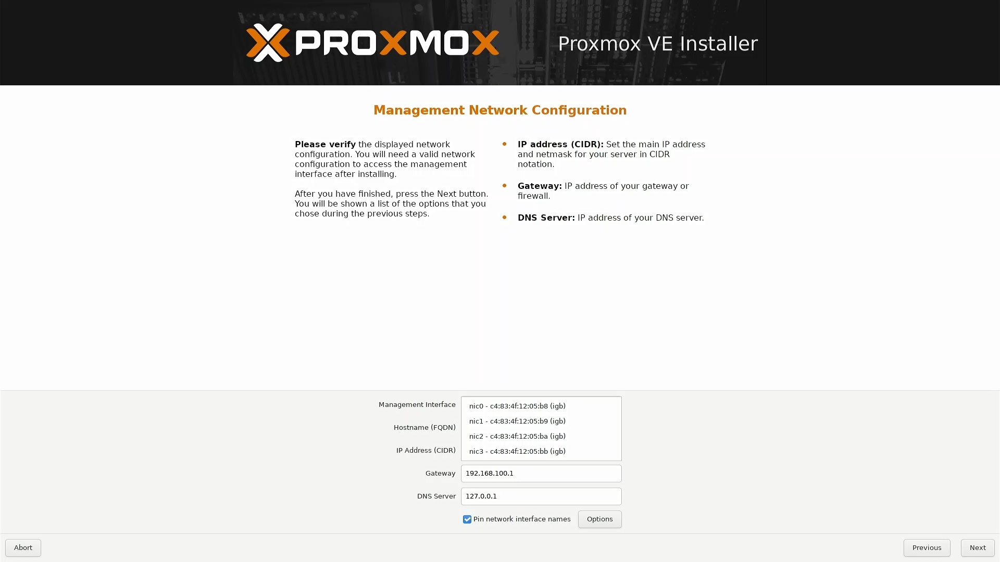

FQDN 为 PVE 的域，PVE 将使用 FQDN 中的二级域名作为其主机名。  

演示中 FQDN 为 `node01.fox.home.arpa` ，因此 PVE 的主机名为 `node01` 。  

根据规划，PVE 的 IPv4 管理地址为 `172.16.1.254` 。  

未来主路由的 IPv4 地址为 `172.16.1.1` ，因此均使用该地址作为 PVE 的网关地址和 DNS 地址。  

当 PVE 安装完成后， 将使用 PVE 提供的 WEB 管理页面，进一步对该管理口的设置进行调整。  

|参数|值|说明|
|--|--|--|
|Hostname (FQDN)|`node01.fox.home.arpa`|设置 PVE `域` 和 `主机名` |
|IP Address (CIDR)|`172.16.1.254/24`|设置 PVE IPv4 地址|
|Gateway|`172.16.1.1`|设置 PVE IPv4 网关|
|DNS Server|`172.16.1.1`|设置 PVE IPv4 DNS |

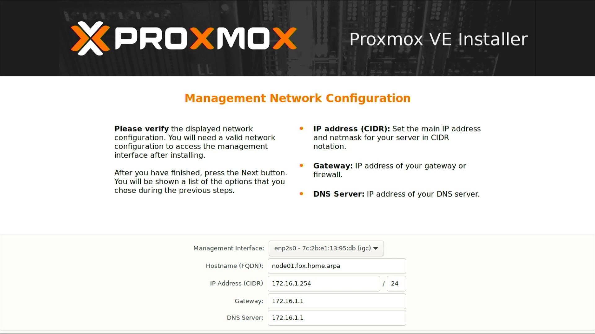

### 1.7. PVE 参数确认

该页面会显示当前 PVE 的安装配置总览，确认无误后即可开始安装。  

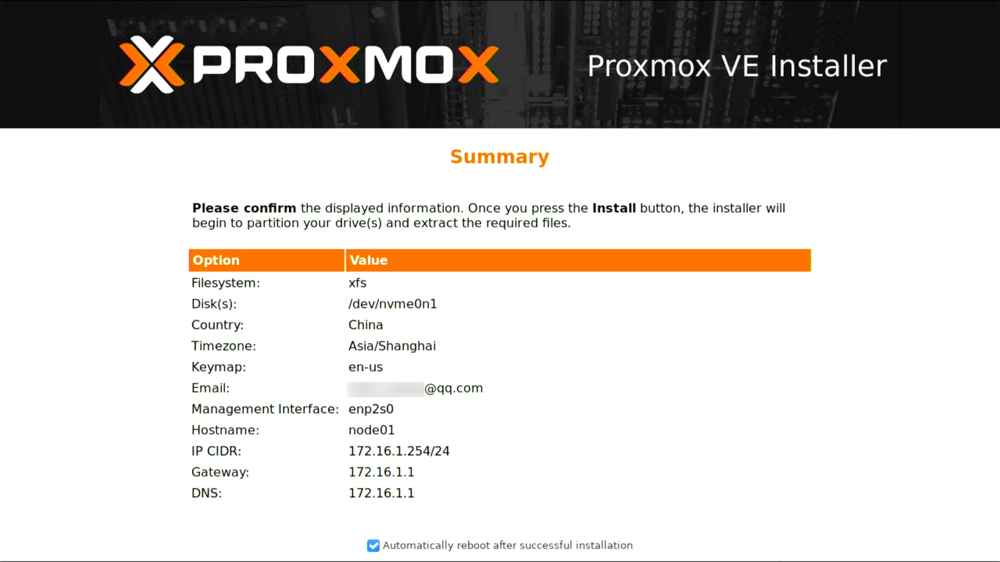

安装完成后，PVE 会告知用户登录的 `IP 地址` 和 `端口` 。  

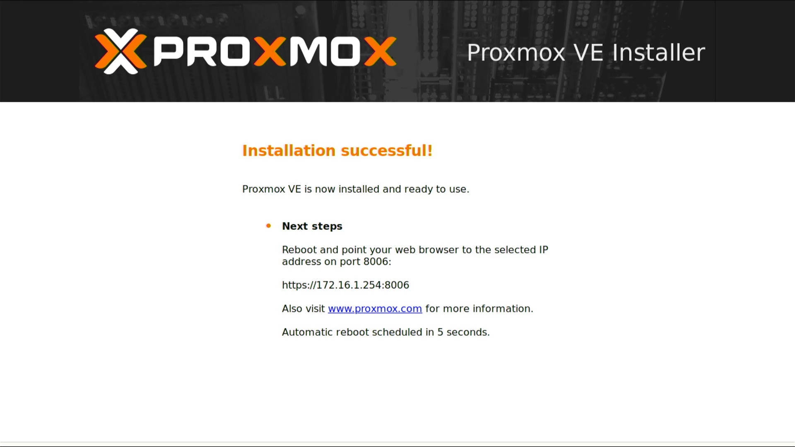

## 2. PVE 安装后检查

PVE 安装完成后会自动重启，等待系统重启完成会显示如下界面，并使用 `root` 账户进行登录，密码为刚才设置的管理密码。  

**注意：Linux 操作系统，在输入密码时是不显示任何字符信息的，输入完成后输入回车即可。**  

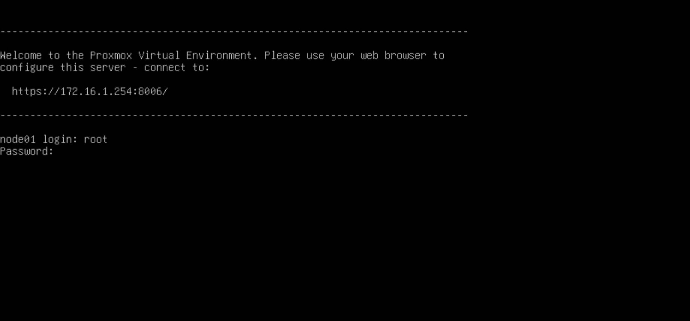

登录系统后，使用一些命令来查看一些基本信息。  

```bash
## 查看系统硬盘与挂载
$ df -hT

$ df -hiT

$ cat /etc/fstab

## 查看系统代号
$ cat /etc/os-release
```

此处显示出 PVE 底层使用的是 Debian 的系统，代号为 `bookworm` ，该代号后续会使用到。  


至此 PVE 的安装步骤已经完成。  

