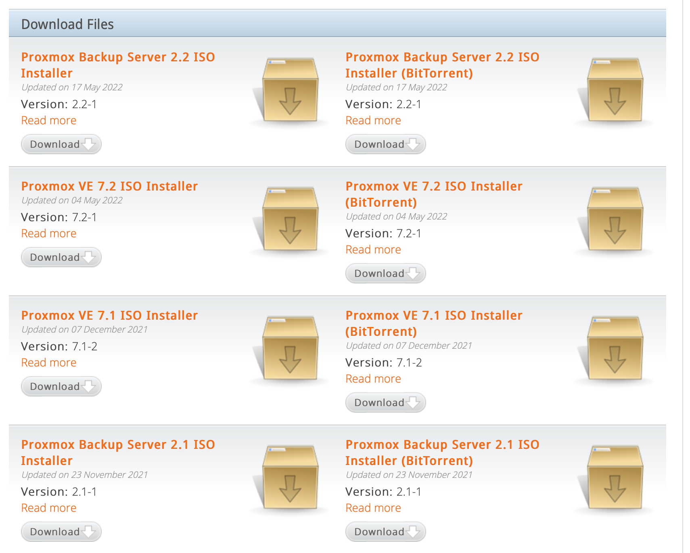
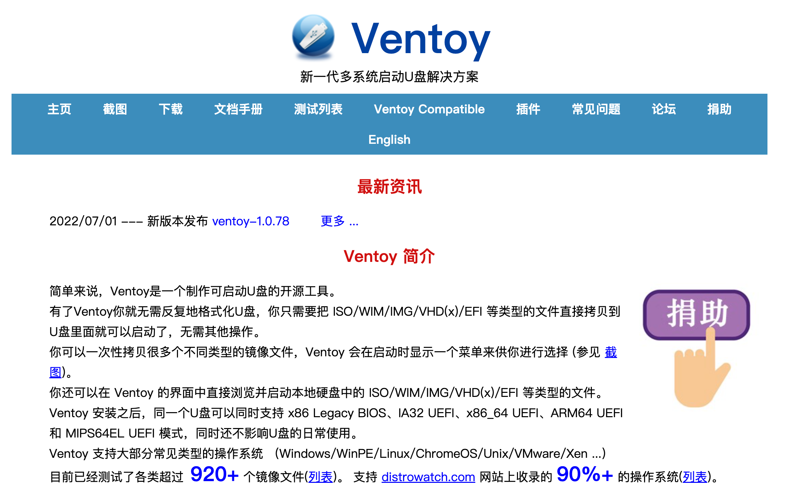
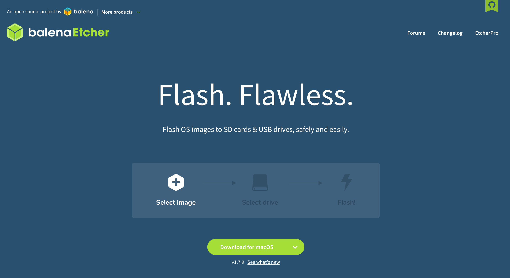
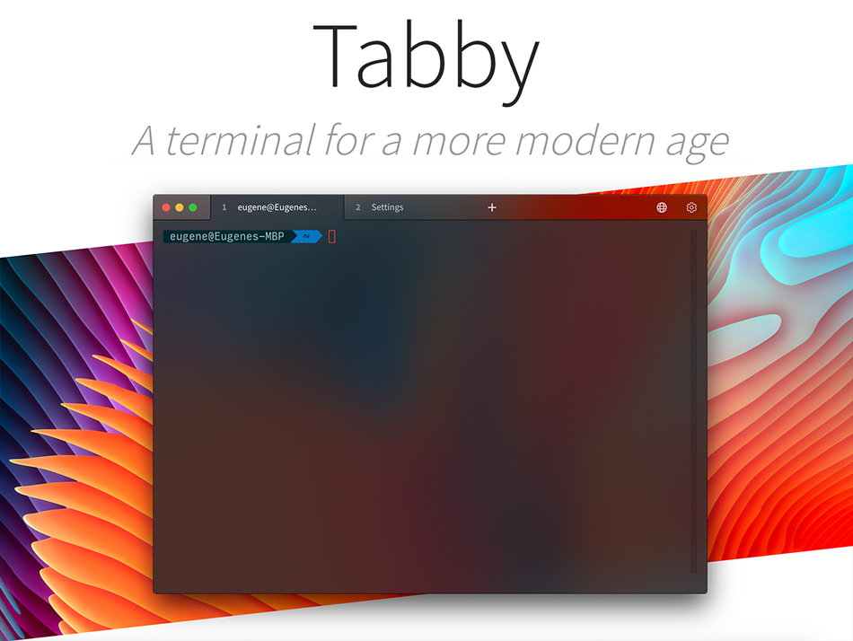
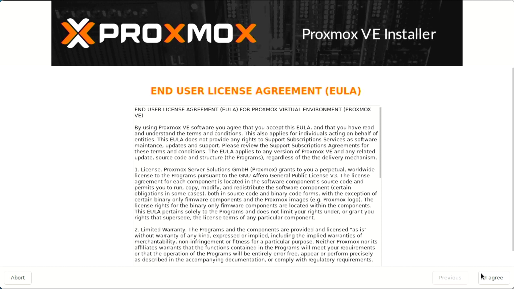
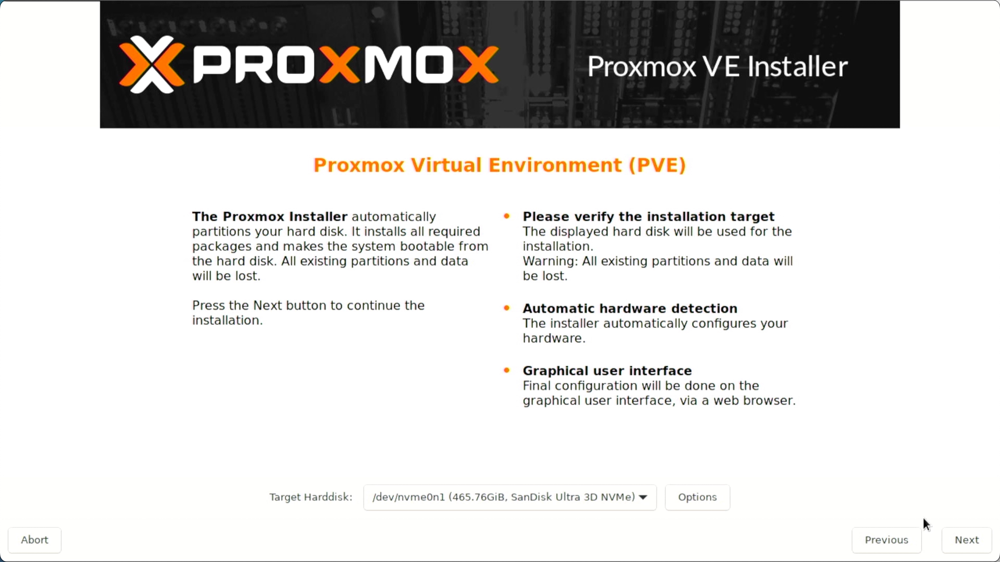
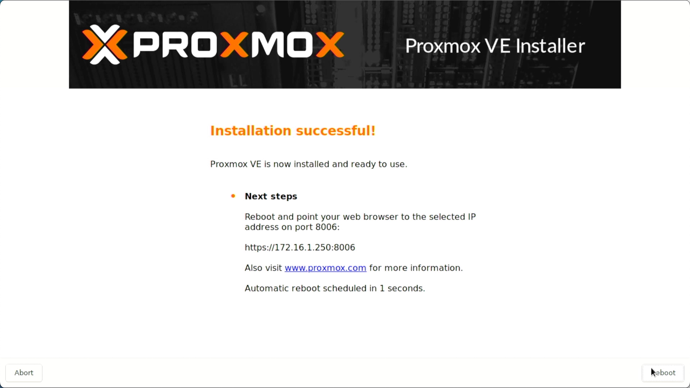

## 0.安装前准备

PVE 系统正式安装之前，需要准备 PVE 的安装镜像和一些必要安装工具。


### 0.1.PVE镜像下载
  
PVE 下载地址：https://www.proxmox.com/en/downloads



点击 `Proxmox VE 7.x ISO Installer` 链接。此处可能有多个 PVE 的安装 ISO，可以根据需要进行选择。  

此处我以目前最新的 `Proxmox VE 7.2 ISO` 作为演示。  


下载 ISO 时请注意 `SHA256SUM` ，后续将使用该校验信息对下载下来的 ISO 进行校验，以确保 ISO 文件的完整性。  


### 0.2.启动盘制作工具

考虑到制作 PVE 启动盘时，所使用的操作系统可能有 Windows、macOS、Linux，因此我这里推荐几个常用的写盘工具。

#### Ventoy

官方网站地址：https://www.ventoy.net/cn/index.html  

强烈推荐的引导盘制作工具，也是我目前在用的写盘工具，优点是可以在一个 U 盘中放入复数个可引导的 ISO 文件。  

免去了多次格式化 U 盘再写入 ISO 文件的操作，非常友好。  

缺点是只支持 Windows、Linux。 
 


#### Etcher

官方网站地址：https://www.balena.io/etcher/  

跨平台的写盘工具，开源，写盘速度很快。缺点是该软件体积较大，下载缓慢。    

支持 Windows、macOS、Linux。   



#### Rufus

官方网站地址：https://rufus.ie/zh/  

轻便小巧的写盘工具，仅支持 Windows。   


### 0.3.SSH工具

考虑到配置 PVE 服务器、路由器、DNS 服务器时，需要在 CLI 中输入命令，因此我这里推荐几个常用的 SSH 工具。

#### Tabby

官方网站地址：https://tabby.sh  

基于 Electron 开发的开源跨平台终端工具，内部集成了 SFTP，可以在 Github 平台上进行下载。  

支持 Windows、macOS、Linux。   



#### MobaXterm

官方地址：https://mobaxterm.mobatek.net  

功能强大的 SSH 工具，仅支持 Windows。   


## 01.PVE系统安装

由于机型不同，BIOS 的设置也不同，所以本文不演示具体如何将机器设置成从 U 盘启动。  

在设置BIOS时需要注意以下几点：
- 暂时关闭 **“安全启动”**
- 确保打开硬件虚拟化支持
- 确保硬盘的模式为“AHCI”
- 确保设备来电自动启动
- 对于不支持UEFI启动的设备，检查Legacy引导模式
- 检查CPU的功耗设置（可选）

### 1.1.设备引导

我使用 Ventoy 进行设备引导后，出现如下画面，选择 PVE 的安装 ISO ：


等待引导跑码完成后，即进入 PVE 的安装界面。

### 1.2.PVE安装选项

选择第一项 `Install Proxmox VE` 开始安装 PVE 。  


设备将会继续跑码，直到 EULA 最终用户许可协议出现，选择 `I agree` 。



### 1.3.PVE磁盘选项

此时会出现 `Target Harddisk` 选项，会显示出设备中存在的磁盘列表。  

可以通过下拉框选择希望安装 PVE 的物理磁盘。  



点击磁盘列表右侧的  **Options** ，对 PVE 的磁盘安装参数进行一些调整。  

我推荐将 `Filesystem` 也就是磁盘的文件系统格式，设置成  **xfs** 。  

如果设备安装的内存比较小，比如只有 `4GB` 、`8GB` ，可以酌情考虑将 `swapsize` 改大，比如 `8`（此处无需填写单位 GB ）。  


虽然 PVE 系统会根据设备安装的内存大小自动计算合理的 `swapsize` ，但我安装了 `16GB` 内存，因此我此处仅给了 `4GB` 的空间作为交换空间。  

### 1.4.PVE时区选项

PVE 此时处于未接入互联网的 “离线” 安装状态，因此不会从互联网中读取时区信息，我们需要手动修改时区。  

在 `Contry` 处手动输入 `China` ，下方的 `Time zone` 将自动变更为 `Asia/Shanghai` 。


### 1.5.PVE账户与邮箱

PVE 为最关键的虚拟化层，建议使用强密码，包含大小写字母、数字以及特殊符号。  

`Email` 必须为一个 “合法” 的邮箱地址，不然系统会判定邮箱地址不合法并拒绝继续安装。  


### 1.6.PVE网络设置

PVE 必须选择一个管理网口，默认情况下，PVE 会使用编号较小的第一个网口作为管理网口。  

而有的设备物理网口顺序与该页面显示的网口顺序 **不一致** ，因此此处保持默认的第一个网口。  

当 PVE 完全安装好之后， **会在 PVE 提供的 WEB 页面中对该管理网口设置进行调整** 。  


根据我们之前的规划，对 PVE 的管理 IP（`172.16.1.250`）进行设置。  

需要说明的是 `Hostname` ，即 PVE 主机的名称，PVE 将使用输入的 “二级域名” 的名称作为自己的名称。  

演示内容输入的为 `hyper.fox.lab` ，因此 PVE 获取的主机名称为 `hyper` 。  

我们规划未来主路由的IP地址为 `172.16.1.1` ，因此我们网关和 DNS 地址均使用该地址。  

- Hostname (FQDN) 
    - hyper.fox.lab
- IP Address (CIDR)
    - 172.16.1.250/24
- Gateway
    - 172.16.1.1
- DNS Server
    - 172.16.1.1


### 1.7.PVE参数确认与安装

最后会显示出当前 PVE 安装的配置清单，确认无误后即可开始安装。  


安装完成后，PVE 会告知用户登录的 `IP 地址` 和 `端口` 。




## 2.PVE安装后检查

PVE 安装完成后会自动重启，等待系统重启完成会显示如下界面，并使用 `root` 账户进行登录，密码为刚才设置的管理密码。  

 **注意：Linux 操作系统，在输入密码时是不显示任何字符信息的，输入完成后输入回车即可。**   


登录系统后，我们使用一些命令来查看一些基本信息：


```bash
## 查看系统磁盘与挂载
df -hT

cat /etc/fstab

## 查看系统代号
cat /etc/os-release

```

此处显示出 PVE 底层使用的是 Debian 的系统，代号为 `bullseye` ，该代号后续会使用到。  

至此 PVE 的安装步骤已经完成，后续将对管理网口的设置以及系统源进行调整，使用国内镜像源，去掉 PVE 的订阅仓库，使用开源 PVE 仓库。