## 0.前期准备

将虚拟机制作成模板，可在后续新建虚拟机时快速从模板中创建，减少系统安装配置时间。  

该虚拟机模板主要用作内网 DNS 服务器，由 `Adguard Home` 或 `SmartDNS` 提供 DNS 解析服务。  

本文将使用 Debian 的云镜像 `debian-13-generic-amd64.qcow2` 作为模板虚拟机的镜像。  

访问 [Debian Official Cloud Images](https://cloud.debian.org/images/cloud/) 官方网站，下载最新版 `Trixie` 云镜像以及对应的校验文件。  

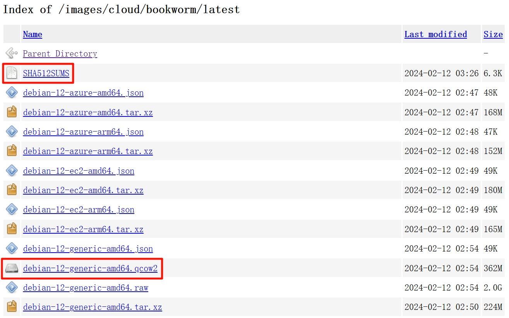

## 1.创建虚拟机

登录 PVE 管理后台，点击页面右上角 `创建虚拟机` ，进入虚拟机创建流程。  

### 1.1.常规

勾选底部 `高级` 选项，显示完整的配置参数，节点即 “本机” ，`VM ID` 和 `名称` 可自定义。  

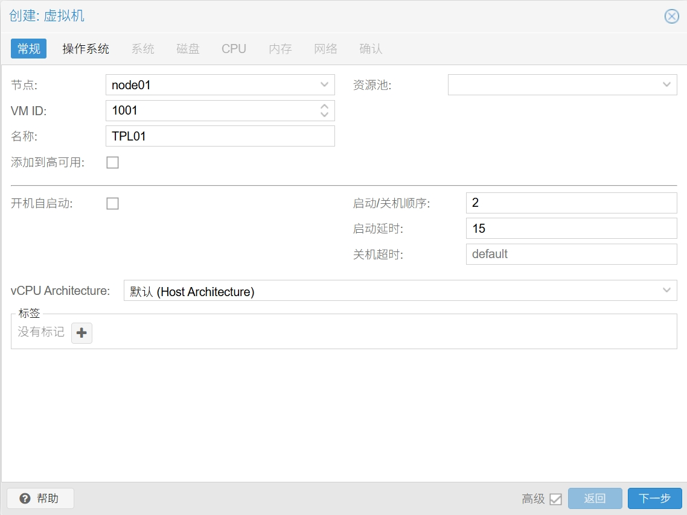

### 1.2.操作系统

无需使用任何安装介质，客户机操作系统类别选择 `Linux` ， 版本选择 `7.x - 2.6 Kernel` 即可。

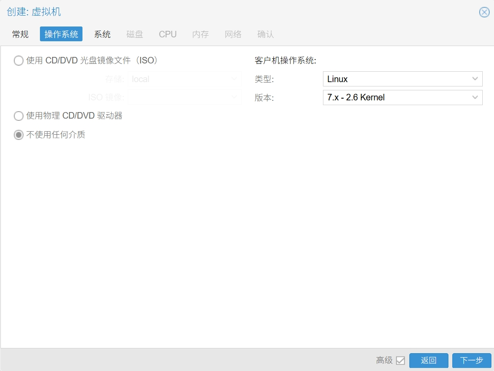

### 1.3.系统

SCSI 控制器保持默认 `VirtIO SCSI single` ，机型可选 `q35` ，并勾选 `Qemu 代理` 选项。  

固件可选 `OVMF (UEFI)` ，并勾选 `添加 TPM` 选项，存储路径需根据实际情况进行调整，演示为 `local-lvm` 。  

`预注册密钥` 可启用，启用后将预装特定于发行版和 Microsoft 标准的安全启动密钥。  

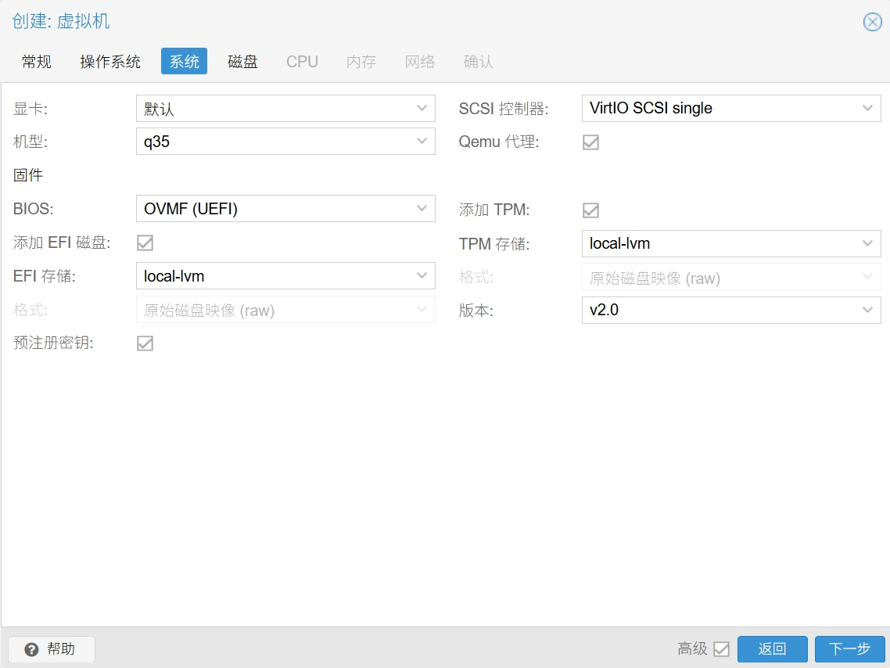

### 1.4.磁盘

因使用 Debian 云镜像制作虚拟机模板，此处需删除所有 `磁盘` 。  

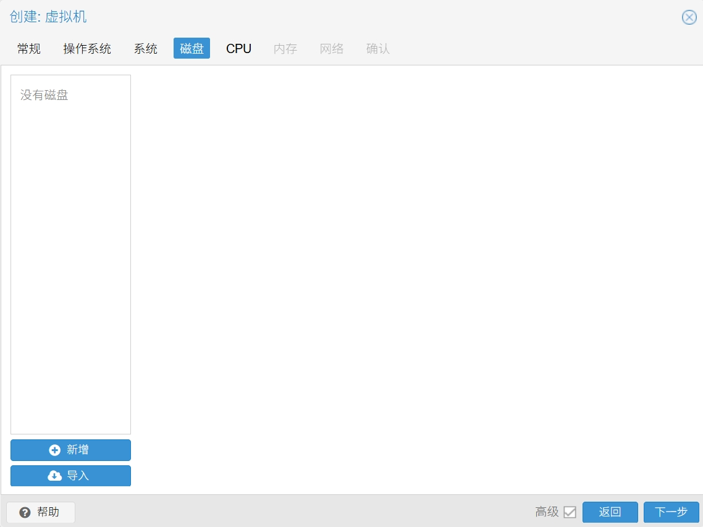

### 1.5.CPU

CPU `类型` 选择 `host` ，`插槽` 与 `核心` 数根据物理 CPU 核心数进行酌情设置。  

若 PVE 服务器内有多颗物理 CPU ，则推荐勾选 `启用 NUMA` 选项。  

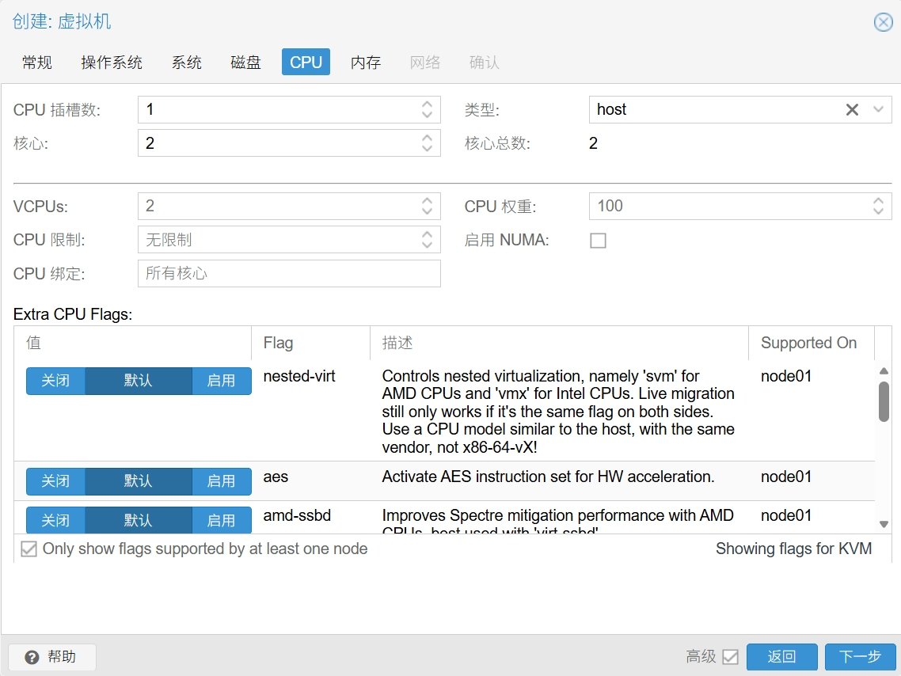

### 1.6.内存

建议将 `内存` 设置为业务峰值需求，`最小内存` 原则上不低于 `内存` 的 `75%` 。  

默认启用 `Ballooning 设备` ，使 PVE 能够获取虚拟机内部的内存统计，并在宿主机出现内存压力时动态回收和调配内存。  

将 `最小内存` 设置为与 `内存` 相同，可保留统计能力，同时为虚拟机提供固定的内存保障。  

对于 `允许 KSM` 内核同页合并功能，建议保留勾选状态。  

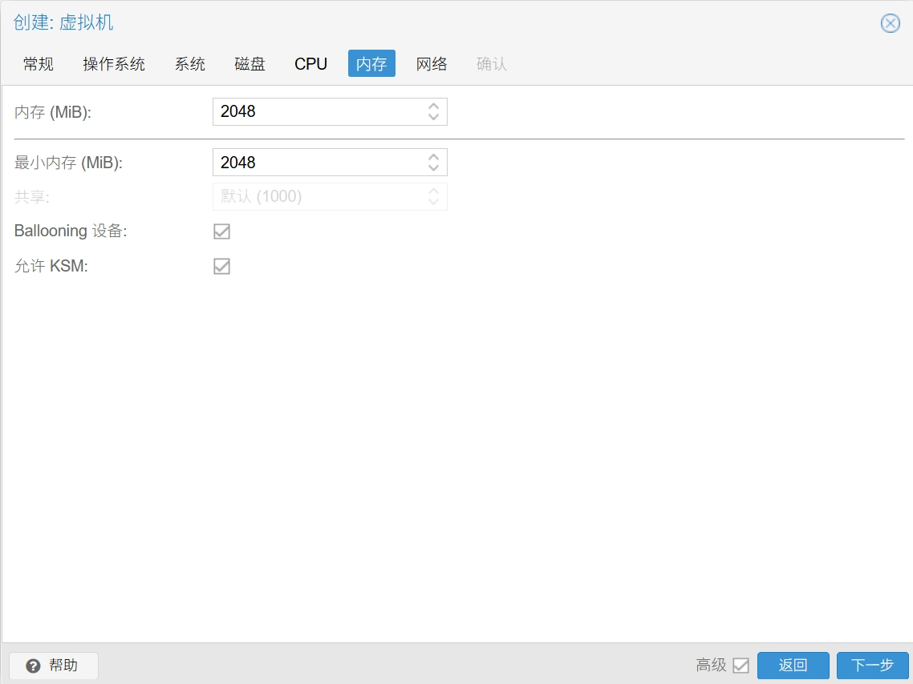

### 1.7.网络

通常情况下，模板虚拟机的 `桥接` 参数设为 PVE 管理口所在虚拟网桥即可。  

因在 [02.PVE初始化配置](./02.PVE初始化配置.md) 中曾创建未桥接物理网口的内部网桥，故可根据实际需求选择是否使用纯内部网桥作为该参数值。  

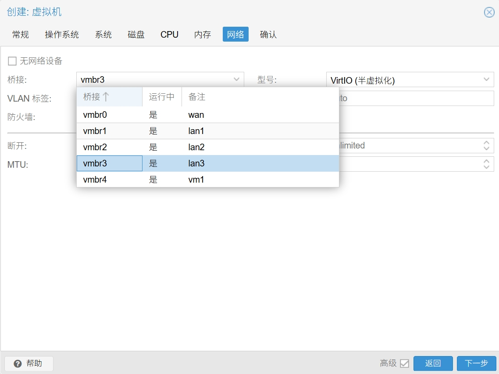

多数情况下，无需使用 PVE 内建防火墙，因此 **取消勾选** 网络设备的 `防火墙` 选项。  

推荐在 `Multiqueue` 处根据前面设置的 CPU 核心数进行网卡多队列设置，设置比例为 1:1 。  

即有 n 个 CPU 核心，此处多队列也设置为 n 。  

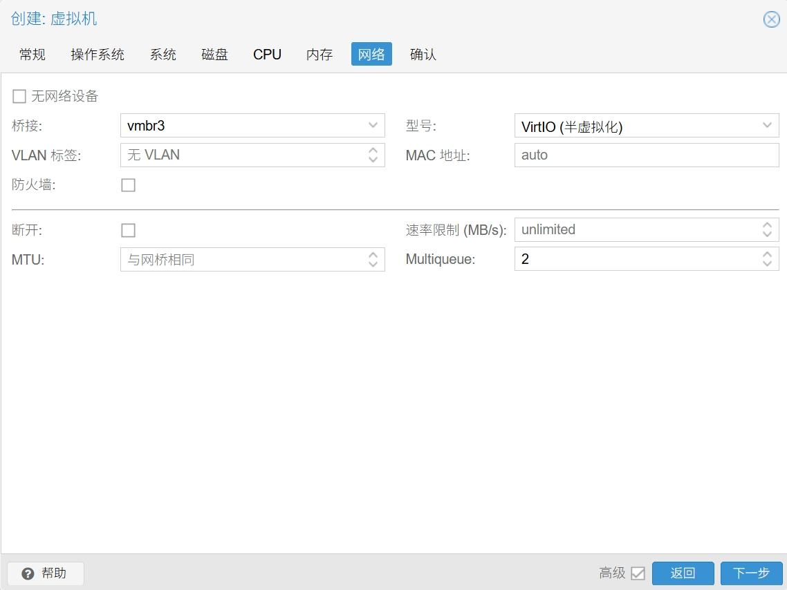

### 1.8.确认

接下来查看设置总览，确认无误后即可点击 `完成` 。  

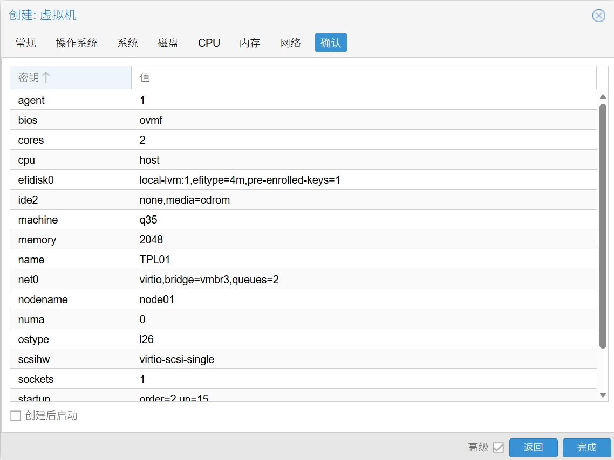

## 2.调整硬件参数

### 2.1.删除光驱

查看虚拟机详情页，在虚拟机 `硬件` 配置页面，移除其 `CD/DVD驱动器` 。  

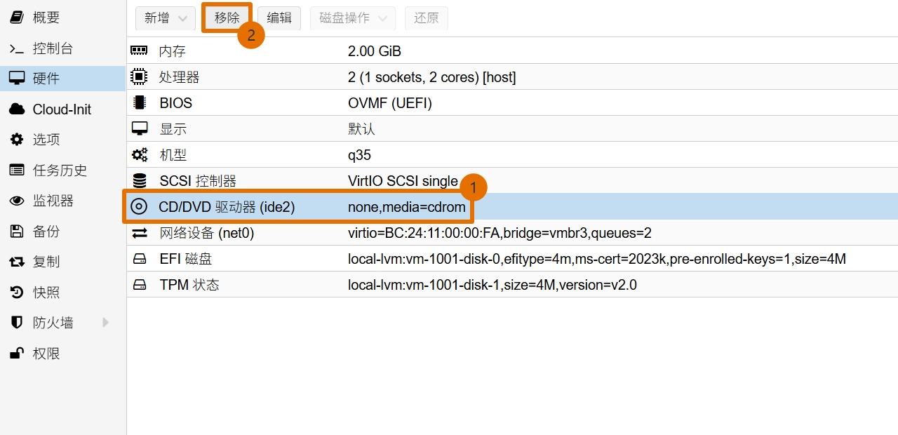

### 2.2.添加 VirtIO RNG

为确保系统拥有充足的可用熵，需为模板虚拟机添加 `VirtIO RNG` 熵源。  

点击顶部 `新增` 菜单，选择 `VirtIO RNG` 。  

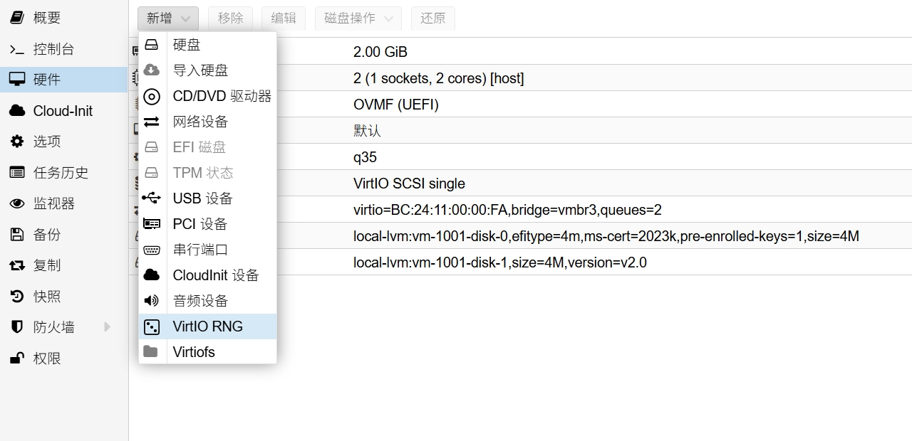

`熵源` 选择 `/dev/urandom` ，其余参数保持默认即可。  

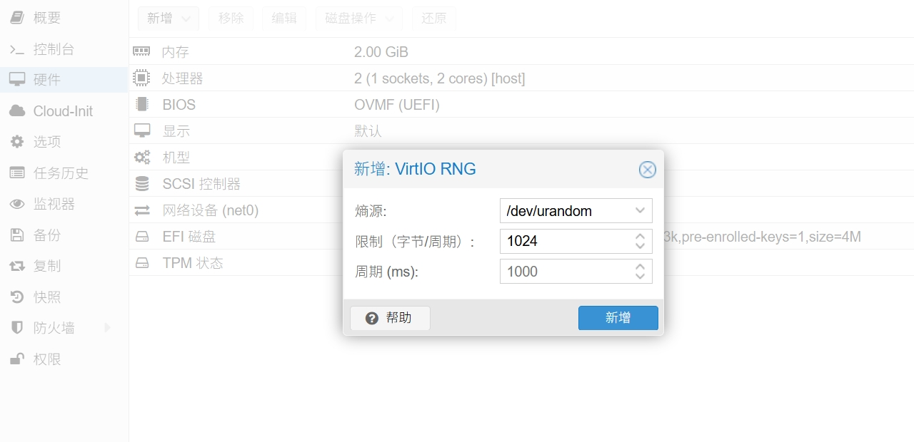

### 2.3.添加串行端口

在基于 Debian Cloud Image 创建 VM 时，须在虚拟机硬件列表中添加 `串行端口` 设备 `serial0` 。  

补全串口硬件可避免系统因缺失 `/dev/ttyS0` 而无限循环报 `agetty` 输入/输出错误，同时可启用 PVE 的 `xterm.js` 控制台（支持原生复制粘贴）。  

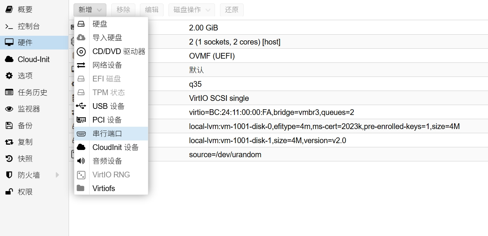

`串行端口` 设置为 `0` 即可。  

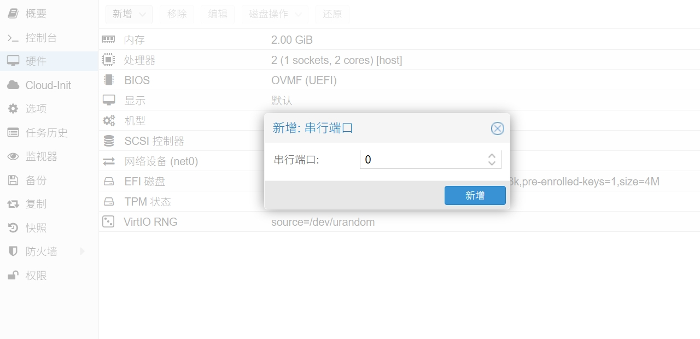

### 2.4.导入镜像文件

使用终端工具登录 PVE 服务器，并进入 `/tmp` 目录，执行以下命令创建一个目录。  

```bash
## 创建存放 Debian 云镜像的临时目录
$ mkdir -p /tmp/Debian

## 进入目录
$ cd /tmp/Debian
```

将 Debian 云镜像传输到该目录，并检查 `hash` 。  

```bash
## 下载云镜像校验文件
$ curl -LR -O https://cloud.debian.org/images/cloud/trixie/latest/SHA512SUMS

## 下载云镜像
$ curl -LR -O https://cloud.debian.org/images/cloud/trixie/latest/debian-13-generic-amd64.qcow2

## 检查文件是否存在
$ ls -lah

## 显示校验文件内容
$ cat SHA512SUMS

## 计算文件 hash
$ sha512sum debian-13-generic-amd64.qcow2
```

确认无误后，将镜像文件导入刚才创建的虚拟机，命令中的 `VM ID` 需要根据实际情况替换，演示为 `1001` 。  

```bash
## 将 qcow2 镜像导入虚拟机中
$ qm importdisk 1001 debian-13-generic-amd64.qcow2 local-lvm

#### 镜像导入示例输出
unused0: successfully imported disk 'local-lvm:vm-1001-disk-2'
```

磁盘导入成功后，虚拟机硬件列表中将显示一块未使用的磁盘设备，可鼠标 **双击** 该设备进行配置调整。  

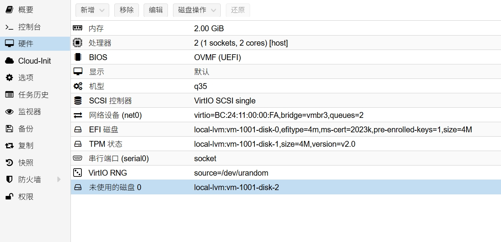

当宿主机使用 SSD 作为物理存储设备，并且虚拟磁盘采用 Thin Provisioning （精简置备）模式时，可考虑开启以下选项：  

- `丢弃` （ `Discard` ） 选项，有助于存储空间回收。  

- `SSD 仿真` （ `SSD Emulation` ） 选项，让虚拟机将虚拟磁盘视为 SSD 存储设备。  

在弹出的对话框中，确认 `IO thread` 选项为 **勾选** 状态，并点击 `新增` 。  

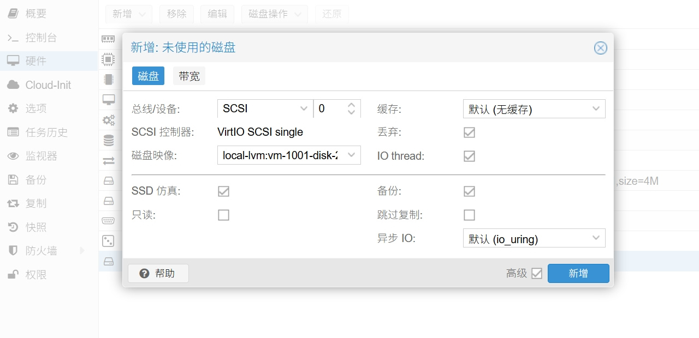

导入的镜像仅具备 `3G` 磁盘空间，为方便后续使用，可通过 `qm` 命令直接将该磁盘调整至目标容量。  

```bash
## 将镜像容量设置为 24G
$ qm disk resize 1001 scsi0 24G

#### 镜像扩容示例输出
  Size of logical volume pve/vm-1001-disk-2 changed from 3.00 GiB (768 extents) to 24.00 GiB (6144 extents).
  Logical volume pve/vm-1001-disk-2 successfully resized.
```

或鼠标 **单击** 选中该磁盘，选择页面顶部 `磁盘操作` 菜单的子菜单 `调整大小` 。  

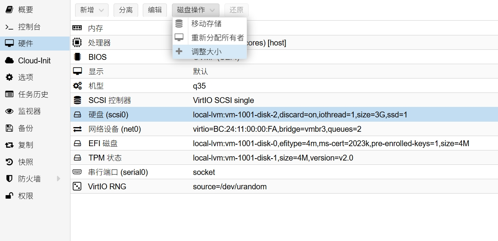

在弹出的对话框中，给该磁盘增加 `21G` 磁盘空间。  

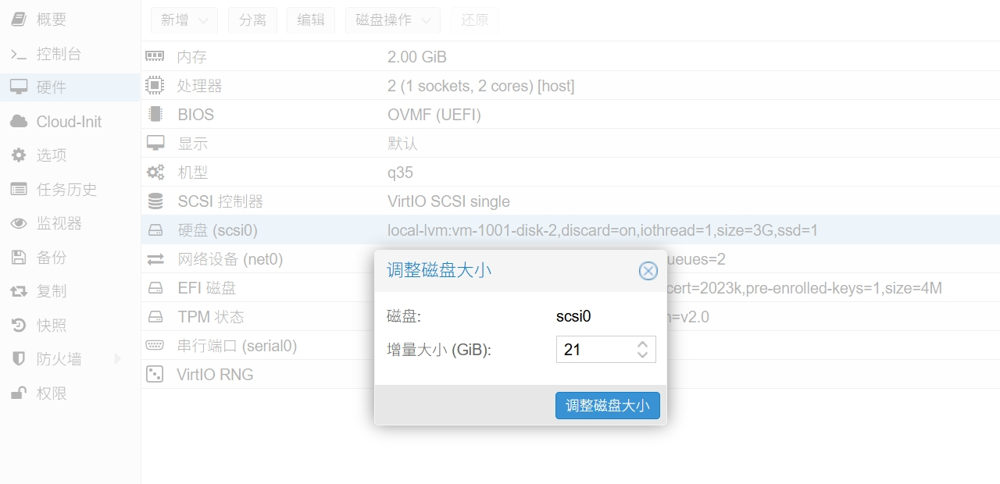

### 2.5.添加 CloudInit

为确保 Cloud-Init 能正常初始化系统，需为模板虚拟机添加 `CloudInit 设备` 。  

同样通过 `新增` 菜单，选择 `CloudInit 设备` 。  

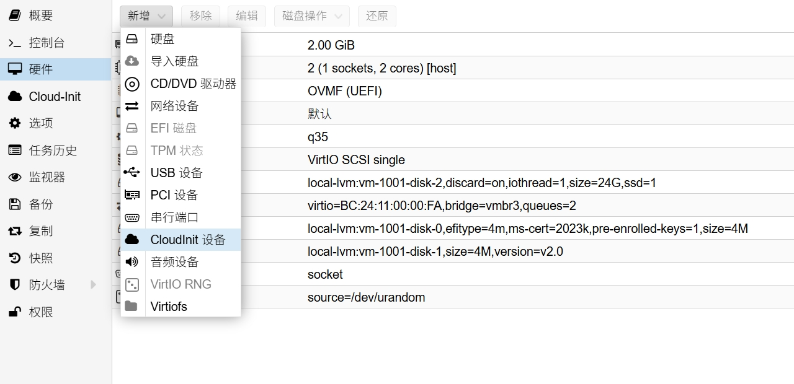

`总线/设备` 选择 `SCSI` ，编号为 `1` ，存储路径需根据实际情况进行调整，演示为 `local-lvm` 。  

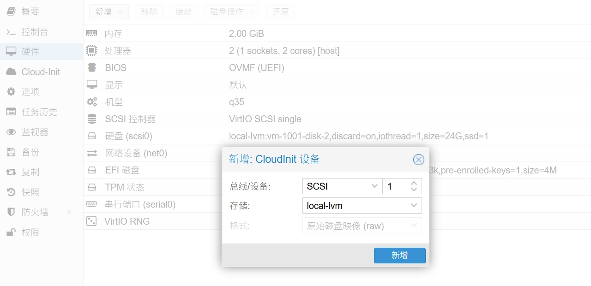

虚拟机硬件设备修改完成后，如下图所示。  

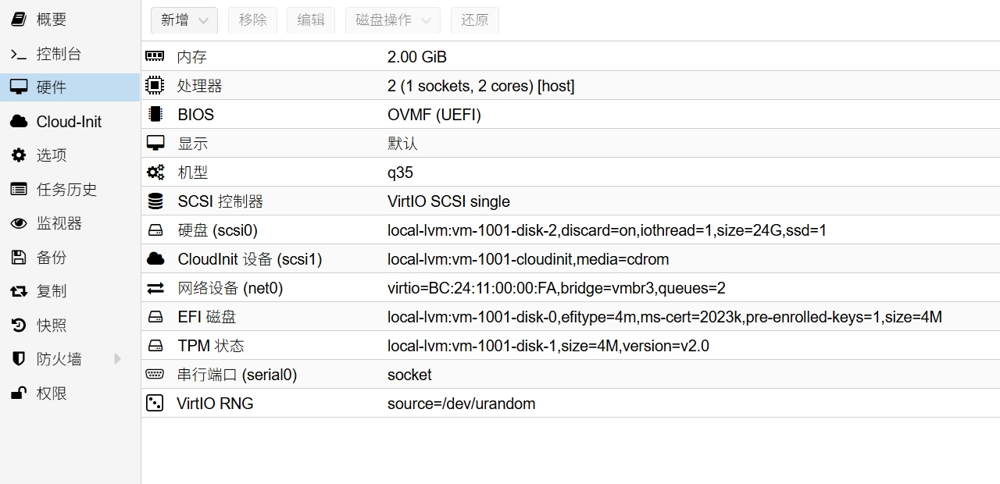

## 3.调整配置参数

进入左侧虚拟机 `选项` 页面，可以看到当前虚拟机的配置参数。  

通常情况下，模板虚拟机的配置参数需要修改以下内容：  

1. 开机自启动（模板无需修改，克隆的虚拟机需要修改）

2. 启动/关机顺序（模板无需修改，克隆的虚拟机需要修改）

3. 引导顺序（仅模板需要修改）

4. 使用平板指针（仅模板需要修改）

### 3.1.修改引导顺序

鼠标 **双击** `引导顺序` 选项，进入编辑界面。  

在 `scsi0` 设备处勾选 “已启用” 复选框，并通过排序功能将其拖拽至首位，点击 `确定` 即可。  

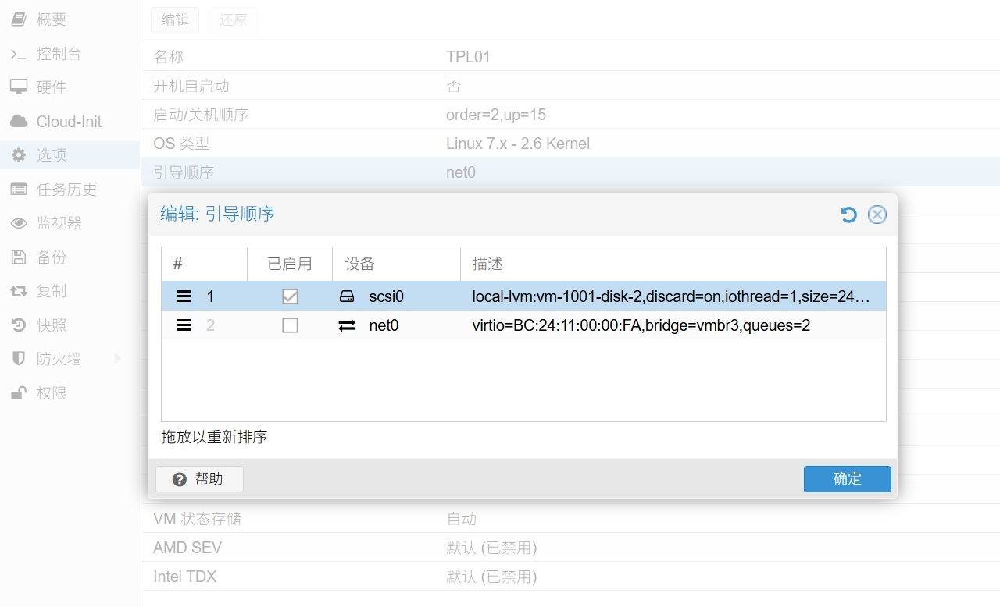

### 3.2.设置平板指针

关闭 `使用平板指针` 选项，可以一定程度上降低虚拟机的 CPU 使用率。  

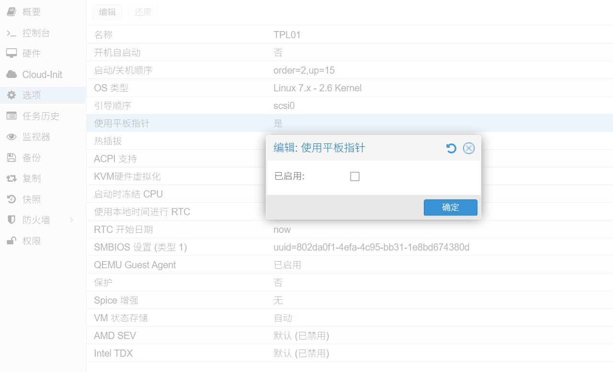

## 4.设置 Cloud-Init

进入左侧虚拟机 `Cloud-Init` 页面，可以看到当前虚拟机的初始化参数。  

### 4.1.自动配置 IPv6

根据之前的网络规划，内网的 IP 地址段为 `172.16.1.0/24` ，因此模板虚拟机的参数如下。  

|参数|值|说明|
|--|--|--|
|用户|`fox`|新系统的管理员账户|
|密码|`********`|使用强密码|
|DNS 域|`fox.internal`|内网域名（可选）|
|DNS 服务器|`172.16.1.1`|本机 DNS 服务器|
|SSH 公钥|`无`|使用秘钥登录服务器，暂不使用|
|升级程序包|`是`|启动时更新软件包，保持默认即可|
|IP 配置 (net0)|`ip=172.16.1.250/24,gw=172.16.1.1,ip6=auto`|模板的 IP 设置|

**额外说明：**  
- 修改 `Cloud-Init` 参数时，需要在虚拟机关机情况下修改才会生效  
- `DNS服务器` 参数支持输入多个 IPv4 / IPv6 地址，使用空格隔开  
- 当前 `DNS服务器` 参数为主路由 LAN 口 IPv4 地址，确保虚拟机能正常联网  

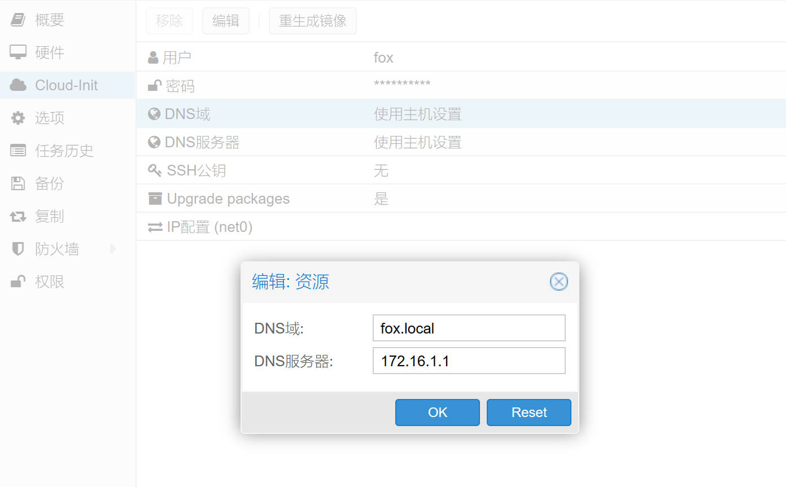

`Cloud-Init` 的 `IP 配置` ，IPv4 使用 `静态` 地址，IPv6 使用 `SLAAC` 自动配置，如下图所示。  

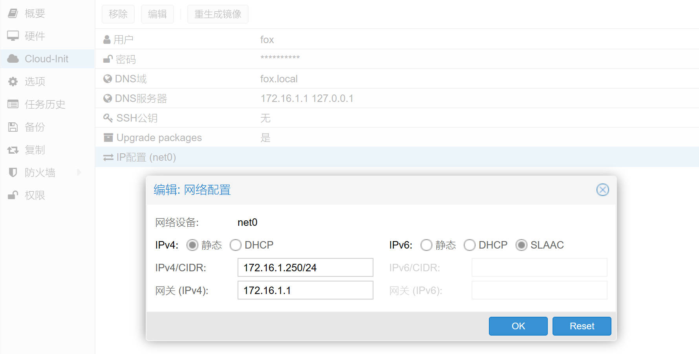

### 4.2.手动配置 IPv6

当主路由配置了 IPv6 ULA 网段，且希望指定内网 DNS 服务器的 IPv6 ULA 地址时，需要调整 `Cloud-Init` 参数。  

本文 IPv6 ULA 演示地址段为 `fdac::/64` ，`DNS 服务器` 和 `IP 配置` 参数调整如下。  

|参数|值|说明|
|--|--|--|
|DNS域|`fox.internal`|内网域名（可选）|
|DNS服务器|`172.16.1.1 fdac::1`|本机 DNS 服务器|
|IP配置(net0)|`ip=172.16.1.250/24,gw=172.16.1.1,ip6=fdac::fa/64`|模板的 IP 设置|

`DNS 服务器` 参数中需要加入主路由 LAN 口 IPv6 ULA 地址。  

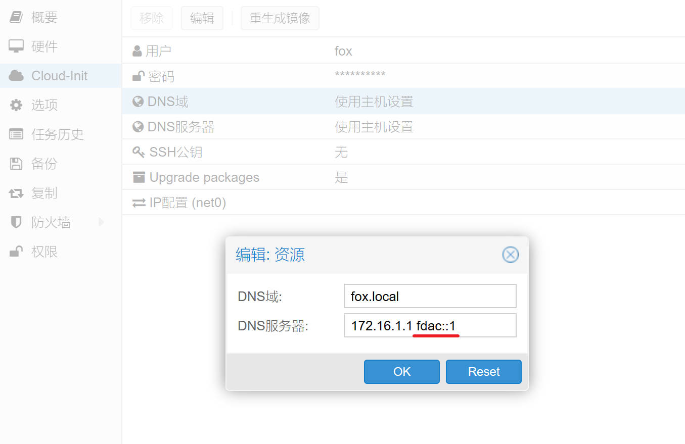

`IP 配置` 参数，IPv4 使用 `静态` 地址，IPv6 同样使用 `静态` 地址，如下图所示。  

IPv6 使用 `静态` 地址后，并不影响虚拟机通过主路由获取 IPv6 GUA 公网地址。  

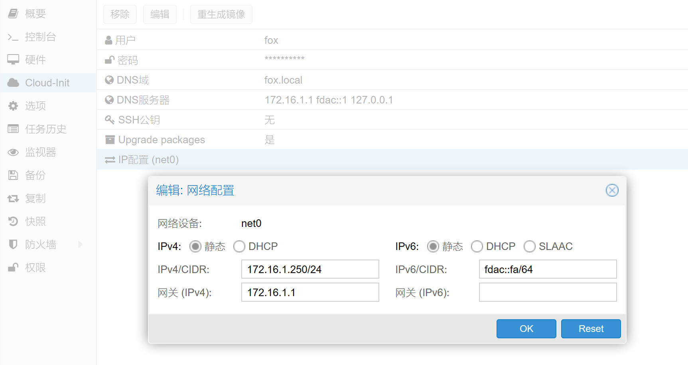

## 5.设置备注信息

进入左侧虚拟机 `概要` 页面，修改虚拟机的备注信息。  

```bash
### 服务器信息

- 系统： Debian 13

- 用途： 内网服务器 ( 模板 )

- 自启： 否

- 用户： fox

- IPv4： 172.16.1.250/24

- IPv6： SLAAC

```

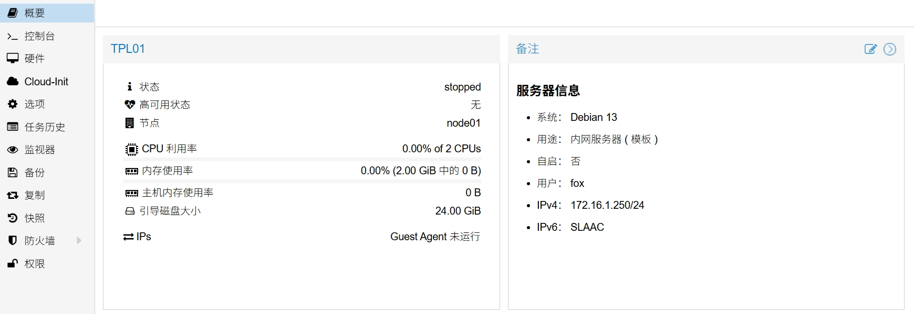

至此，模板虚拟机创建完成，可将该虚拟机开机。  

