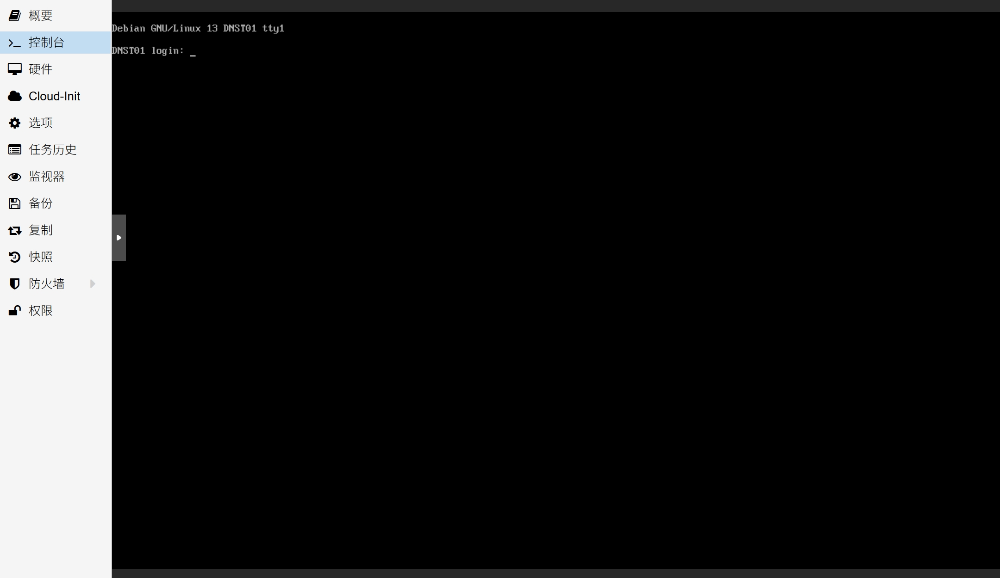
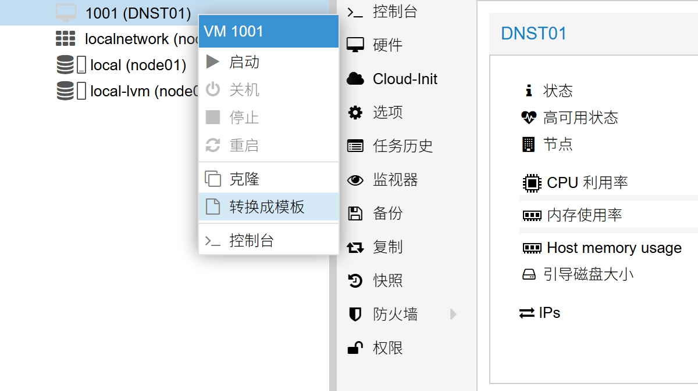

## 1.配置系统

在上一篇文章 [04.PVE创建模板虚拟机](./04.PVE创建模板虚拟机.md) 中，已经创建好了用于制作虚拟机模板的模板虚拟机。  

并调整了模板虚拟机的硬件参数、配置参数，但还需对 Debian 系统进行调整。  

此时将模板虚拟机开机后，使用 `Cloud-Init` 中设置的账号密码进行登录。  

### 1.1.配置 SSH

因为 Debian 的云镜像默认使用 SSH 秘钥登录，因此切换到左侧菜单的 `控制台` 进行登录。  



在虚拟机的命令行界面，使用 `vim` 编辑器编辑 `sshd` 服务的配置文件，执行以下命令。  

`vim` 编辑器常用操作如下：  

- 编辑文件，按下键盘 `i` 键，进入编辑模式。  

- 保存文件，按下键盘 `Esc` 键，退出编辑模式，再输入组合键 `:wq` 即可保存。  

```bash
## 编辑 SSH 配置文件
$ sudo vim /etc/ssh/sshd_config.d/10-server-sshd.conf
```

在配置文件中添加以下配置项，并保存。  

```bash
## SSH 配置项

PasswordAuthentication yes
PermitEmptyPasswords no
UseDNS no

```

修改完成后，需要重启 SSH 服务。  

```bash
## 重启 ssh.service
$ sudo systemctl restart ssh.service
```

### 1.2.配置软件源

使用终端工具登录模板虚拟机，常用终端工具请参阅 [01.PVE系统安装](./01.PVE系统安装.md) 。  

首先需要对 Debian 系统软件源进行修改，这里使用 [USTC](https://mirrors.ustc.edu.cn) 镜像站作为演示。  

当系统版本发生变化时，请参考 USTC 镜像站的官方说明 [USTC Mirror Help - Debian](https://mirrors.ustc.edu.cn/help/debian.html) 。  

Debian12 云镜像的软件源配置采用了 `DEB822` 格式，新版 `sources.list` 配置文件内容如下。  

```bash
## 查看镜像配置文件
$ cat /etc/apt/sources.list

#### 配置文件示例输出
# See /etc/apt/sources.list.d/debian.sources
```

进一步查看新配置文件 `debian.sources` 的内容，其配置包含 `3` 个部分。  

```bash
## 查看新版镜像配置文件
$ cat /etc/apt/sources.list.d/debian.sources

#### 新版配置文件示例输出 (主体部分)
Types: deb deb-src
URIs: mirror+file:///etc/apt/mirrors/debian.list
Suites: bookworm bookworm-updates bookworm-backports
Components: main

Types: deb deb-src
URIs: mirror+file:///etc/apt/mirrors/debian-security.list
Suites: bookworm-security
Components: main

## 查看关联的配置文件
$ cat /etc/apt/mirrors/debian.list

#### 关联配置文件示例输出 (关联部分 1 )
https://deb.debian.org/debian

## 查看关联的配置文件
$ cat /etc/apt/mirrors/debian-security.list

#### 关联配置文件示例输出 (关联部分 2 )
https://deb.debian.org/debian-security
```

因此，修改 Debian12 软件源的方式也有两种，本文将尝试使用第 `2` 种修改方案。  

1. 删除当前软件源配置文件，重新启用常规 `sources.list` 配置文件的配置方案。  

2. 根据当前软件源配置文件的语法规则，仅修改配置文件。  

使用 `vim` 编辑器编辑 `debian.sources` 配置文件，执行以下命令。  

```bash
## 编辑 debian.sources 配置文件
$ sudo vim /etc/apt/sources.list.d/debian.sources
```

删除里面全部内容，添加以下配置项，并保存。  

```bash
## 系统软件源配置项

Types: deb
URIs: https://mirrors.ustc.edu.cn/debian
Suites: bookworm bookworm-updates
Components: main contrib non-free non-free-firmware
Signed-By: /usr/share/keyrings/debian-archive-keyring.gpg

Types: deb
URIs: https://mirrors.ustc.edu.cn/debian-security
Suites: bookworm-security
Components: main contrib non-free non-free-firmware
Signed-By: /usr/share/keyrings/debian-archive-keyring.gpg

```

为了防止 `Cloud-Init` 服务意外修改软件源配置，需要添加文件保护，执行以下命令。  

```bash
## 增加文件保护
$ sudo chattr +i /etc/apt/sources.list.d/debian.sources

## 检查文件保护
$ lsattr /etc/apt/sources.list.d/debian.sources

#### 示例输出
----i---------e------- /etc/apt/sources.list.d/debian.sources
```

### 1.3.安装软件

软件源设置完成后，需要更新系统，执行以下命令。  

```bash
## 清理不必要的包
$ sudo bash -c 'apt clean && apt autoclean && apt autoremove --purge'

## 更新软件源
$ sudo apt update

## 更新系统
$ sudo apt full-upgrade
```

接下来安装系统必要软件，安装 `iperf3` 后，系统将询问是否将其作为系统服务开机自启，选择 `no` 即可。  

```bash
## 安装系统软件
$ sudo apt install qemu-guest-agent btop tmux logrotate cron neovim zsh git

## 安装系统自动更新工具
$ sudo apt install unattended-upgrades powermgmt-base python3-gi

## 安装网络工具
$ sudo apt install nftables sshguard lsof knot-dnsutils

## 安装网络检测工具（可选）
$ sudo apt install iftop iperf3 iperf

## 写入磁盘
$ sudo sync
```

### 1.4.配置 ZSH

`Zsh` 是比 `Bash` 好用的 `Shell` 程序，使用 `oh-my-zsh` 进行配置。  

```bash
## 使用清华大学镜像站安装 oh-my-zsh
$ cd && git clone --depth=1 https://mirrors.tuna.tsinghua.edu.cn/git/ohmyzsh.git

$ cd ohmyzsh/tools && REMOTE=https://mirrors.tuna.tsinghua.edu.cn/git/ohmyzsh.git sh install.sh

## 询问是否切换默认 shell，输入 Y

#### 示例输出
Time to change your default shell to zsh:
Do you want to change your default shell to zsh? [Y/n] y

## oh-my-zsh 安装后清理
$ cd && rm -rvf ohmyzsh .bash_history .zsh_history .shell.pre-oh-my-zsh
```

### 1.5.调整内核参数

由于该 Debian 虚拟机模板将用于克隆内网 DNS 服务器，因此需要调整内核参数来简单优化性能。  

使用 `neovim` 编辑器编辑 **内核参数** 配置文件，执行以下命令。  

```bash
## 编辑 内核参数 配置文件
$ sudo nvim /etc/sysctl.d/99-sysctl.conf
```

在配置文件中添加以下配置项，注意配置中间的空格。  

```bash
# This configuration file is customized by fox,
# Optimize sysctl parameters for local DNS server.

kernel.panic = 20
kernel.panic_on_oops = 1

net.core.default_qdisc = fq_codel

# Other adjustable system parameters

net.core.netdev_budget = 600
net.core.netdev_budget_usecs = 20000

net.core.somaxconn = 8192
net.core.rmem_max = 26214400
net.core.wmem_max = 655360

net.ipv4.igmp_max_memberships = 256

net.ipv4.tcp_challenge_ack_limit = 1000
net.ipv4.tcp_fastopen = 3
net.ipv4.tcp_fin_timeout = 30
net.ipv4.tcp_keepalive_time = 120
net.ipv4.tcp_max_syn_backlog = 512
net.ipv4.tcp_notsent_lowat = 131072
net.ipv4.tcp_rmem = 4096 87380 26214400
net.ipv4.tcp_wmem = 4096 16384 655360

net.ipv6.conf.all.use_tempaddr = 0
net.ipv6.conf.default.use_tempaddr = 0

```

保存该配置文件后，重启系统或者执行以下命令让配置生效。  

```bash
## 让内核参数生效
$ sudo sysctl --system
```

### 1.6.调整系统时间

默认情况下 Debian 云镜像的系统时间需要调整，执行以下命令将系统时区设置为中国时区。  

```bash
## 设置系统时区
$ sudo timedatectl set-timezone Asia/Shanghai

## 检查系统时间
$ date -R

#### 系统时间示例输出
Mon, 26 Jun 2023 16:16:16 +0800
```

Debian 云镜像默认使用 `systemd-timesyncd.service` 同步时间，且需要调整为使用国内 NTP 服务器。  

调整 NTP 服务器参数，执行以下命令。  

```bash
## 创建 NTP 配置目录
$ sudo mkdir -p /etc/systemd/timesyncd.conf.d

## 创建 NTP 配置文件
$ sudo nvim /etc/systemd/timesyncd.conf.d/10-server-ntp.conf
```

在配置文件中添加以下配置项，并保存。  

```bash
# This configuration file is customized by fox,
# Optimize system NTP server.

[Time]
NTP=ntp.aliyun.com ntp.tencent.com cn.pool.ntp.org

```

保存该配置文件后，需重启 `systemd-timesyncd.service` 服务，并再次检查系统 NTP 服务器地址。  

```bash
## 重启 systemd-timesyncd.service
$ sudo systemctl restart systemd-timesyncd.service

## 检查系统 NTP 服务器
$ sudo systemctl status systemd-timesyncd.service
```

如果输出以下类似内容，则表示系统 NTP 服务设置正确。  

```bash
#### NTP 服务示例输出
● systemd-timesyncd.service - Network Time Synchronization
     Loaded: loaded (/lib/systemd/system/systemd-timesyncd.service; enabled; preset: enabled)
     Active: active (running) since Mon 2024-10-07 18:06:29 CST; 9s ago
       Docs: man:systemd-timesyncd.service(8)
   Main PID: 1706 (systemd-timesyn)
     Status: "Contacted time server 203.107.6.88:123 (ntp.aliyun.com)."
      Tasks: 2 (limit: 2315)
     Memory: 1.4M
        CPU: 113ms
     CGroup: /system.slice/systemd-timesyncd.service
             └─1706 /lib/systemd/systemd-timesyncd

Oct 07 18:06:29 DNS01 systemd[1]: Starting systemd-timesyncd.service - Network Time Synchronization...
Oct 07 18:06:29 DNS01 systemd[1]: Started systemd-timesyncd.service - Network Time Synchronization.
Oct 07 18:06:29 DNS01 systemd-timesyncd[1706]: Contacted time server 203.107.6.88:123 (ntp.aliyun.com).
Oct 07 18:06:29 DNS01 systemd-timesyncd[1706]: Initial clock synchronization to Mon 2024-10-07 18:06:29.499548 CST.
```

### 1.7.配置自动更新

配置 Debian 云镜像的系统自动更新，与配置 PVE 系统自动更新方法基本一致，参阅 [03.PVE系统调整](./03.PVE系统调整.md) 。  

配置系统更新之前，先检查当前系统定时器状态。  

```bash
## 检查系统定时器
$ sudo systemctl status apt-daily-upgrade.timer
```

配置系统自动更新策略，执行以下命令，使用键盘 `左右方向键` 进行选择，`回车键` 进行确认。  

```bash
## 配置自动更新策略
$ sudo dpkg-reconfigure -plow unattended-upgrades

## 选择 “是”
<Yes>
```

进一步调整 `20auto-upgrades` 配置文件。  

```bash
## 编辑 20auto-upgrades 配置文件
$ sudo nvim /etc/apt/apt.conf.d/20auto-upgrades
```

删除里面全部内容，添加以下配置项，并保存。  

配置文件中，用来控制更新周期的参数为 `APT::Periodic::Unattended-Upgrade` ，`3` 表示更新周期为 `3` 天。  

```bash
## 系统更新周期配置项

APT::Periodic::Update-Package-Lists "1";
APT::Periodic::Unattended-Upgrade "3";
APT::Periodic::AutocleanInterval "1";
APT::Periodic::CleanInterval "1";

```

进一步调整 `50unattended-upgrades` 配置文件。  

```bash
## 编辑 50unattended-upgrades 配置文件
$ sudo nvim /etc/apt/apt.conf.d/50unattended-upgrades
```

根据 “注释” 中相关说明，调整配置文件。  

因为该配置文件很长，完整的配置文件可查看 [debian_dns_50unattended_upgrades.conf](./src/debian/debian_dns_50unattended_upgrades.conf) 以便对比。  

```bash
## 删除以下行前面的注释符 // ，代表启用

"origin=Debian,codename=${distro_codename}-updates";

## 在配置文件末尾增加以下配置项，代表启用，并调整参数

Unattended-Upgrade::AutoFixInterruptedDpkg "true";

Unattended-Upgrade::Remove-Unused-Kernel-Packages "true";

Unattended-Upgrade::Remove-New-Unused-Dependencies "true";

Unattended-Upgrade::Remove-Unused-Dependencies "true";

Unattended-Upgrade::Automatic-Reboot "true";

Unattended-Upgrade::Automatic-Reboot-Time "03:00";

```

系统自动更新配置文件修改完成后，需要重设自动更新定时器，执行以下命令。  

```bash
## 配置系统定时器
$ sudo systemctl edit apt-daily-upgrade.timer
```

根据配置文件中的提示，在中间空白处填入以下配置项。  

```bash
## 定时器配置项

[Timer]
OnCalendar=
OnCalendar=02:00
RandomizedDelaySec=0

```

设置完成后，重启自动更新定时器并检查其状态，执行以下命令。  

在输出结果中，看到系统自动更新的触发时间为 `02:00` 则表示设置正确。  

```bash
## 重启触发器
$ sudo systemctl restart apt-daily-upgrade.timer

## 再次检查触发器状态
$ sudo systemctl status apt-daily-upgrade.timer
```

### 1.8.配置定时任务

本步骤为可选操作，主要设置系统定时重启。  

```bash
## 查看系统定时任务
$ sudo crontab -l

## 编辑系统定时任务，编辑器选择 nano
$ sudo crontab -e
```

在配置文件末尾，增加以下配置项。  

```bash
## 定时任务配置项

30 4 8,24 * * /usr/sbin/reboot

```

### 1.9.清理系统

Debian 模板虚拟机已经配置完成，在将其转换为模板前需要对系统进行清理。  

```bash
## 清理系统软件包
$ sudo bash -c 'apt clean && apt autoclean && apt autoremove --purge'

## 清理系统缓存
$ sudo bash -c 'find /var/cache/apt/ /var/cache/smartdns/ /var/lib/apt/lists/ /tmp/ -type f -print -delete'

## 清理系统日志
$ sudo bash -c 'find /var/log/ -type f -print -delete'

## 清理命令历史记录文件
$ rm -rvf ~/.bash_history ~/.zsh_history ~/.zcompdump* && history -c

## 关闭系统
$ sudo shutdown now
```

## 2.虚拟机转为模板

在 Debian 模板虚拟机关机后，进入 PVE 的 WEB 管理界面。  

在左侧虚拟机列表中，鼠标 **右键单击** Debian 模板虚拟机，在弹出的菜单中选择 `转换成模板` 。  

需要说明的是，虚拟机 `转换成模板` 的操作是不可逆的。  

如果某些 Debian 系统的配置项有问题，只能在用该模板克隆出来的新虚拟机中进行修改，或者删除并重新制作模板。  



至此 Debian 虚拟机模板制作完成。  

