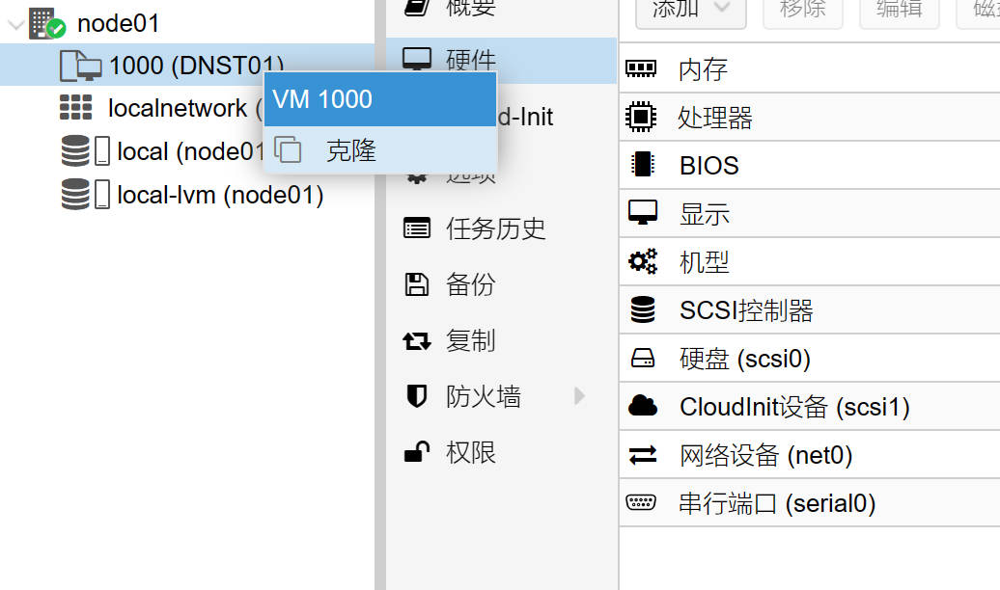
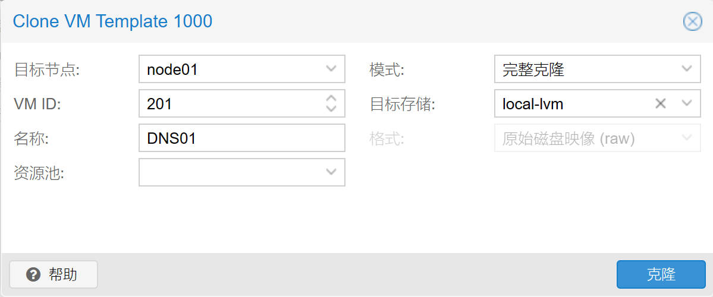
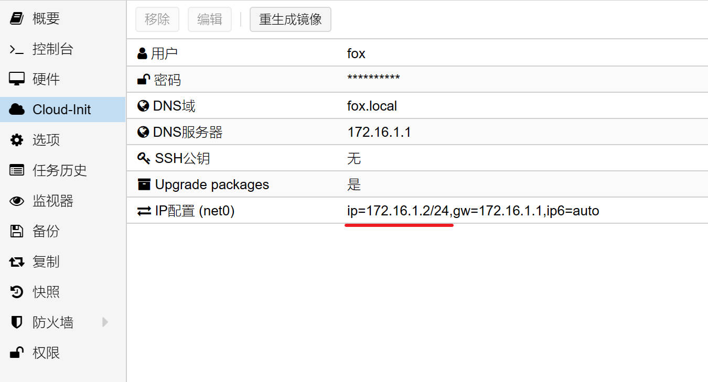
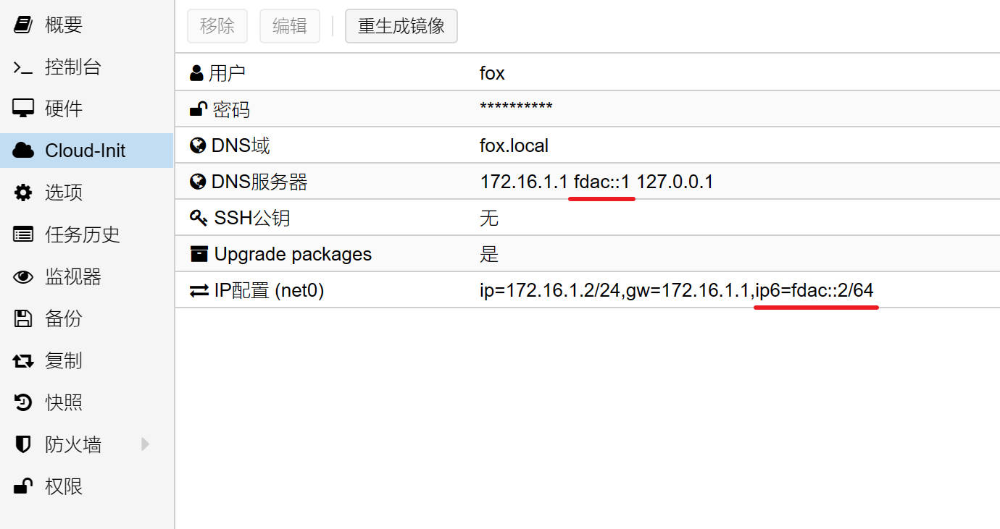
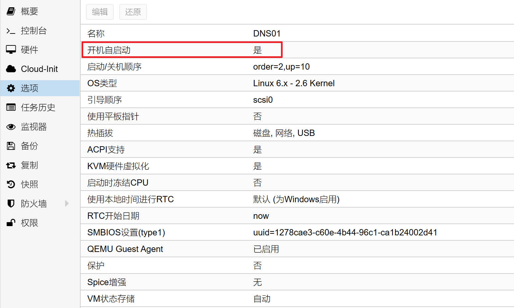

## 1.克隆虚拟机

在上一篇文章 [05.PVE制作虚拟机模板](./05.PVE制作虚拟机模板.md) 中，已经制作好了虚拟机模板。  

接下来将使用该模板克隆出新的虚拟机，并安装 Adguard Home 作为内网的 DNS 服务器。  

鼠标 **右键单击** 虚拟机模板，在弹出的菜单中选择 `克隆` 。  



在弹出的虚拟机克隆对话框中，根据实际情况及下方表格内容，修改虚拟机参数。  

|参数|值|说明|
|--|--|--|
|目标节点|`node01`|当前 PVE 服务器节点|
|VM ID|`201`|可自定义，不能与现存虚拟机 `VM ID` 相同|
|名称|`DNS01`|可自定义，`Cloud-Init` 将使用该名称作为虚拟机 `hostname` |
|模式|`完整克隆`|选择虚拟机的克隆模式|
|目标存储|`local-lvm`|克隆出的虚拟机文件存储位置|

修改参数后，点击 `克隆` ，即可使用该模板克隆出新的虚拟机。  




## 2.调整 Cloud-Init

克隆出来的虚拟机的 `Cloud-Init` 参数默认与模板完全一致。  

根据 **内部网络地址** 规划，内网 DNS 服务器 IPv4 地址规划如下：  

- `172.16.1.2/24`  

- `172.16.1.3/24`  

因此需要调整新虚拟机的 `Cloud-Init` 参数。  

- `IP配置` 中的 IPv4 地址参数为 `172.16.1.2/24` ，网关保持 `172.16.1.1` 不变。

- `IP配置` 中的 IPv6 地址参数为 `auto` ，网关保持为空。

需要注意的是，如果修改了 `用户` 参数，相当于新建了一个系统管理员，之前设置的 `oh-my-zsh` 需要在新管理员下重新设置。  



当主路由配置了 IPv6 ULA 网段，内网 DNS 服务器 IPv6 ULA 地址规划如下：  

- `fdac::2/64`  

- `fdac::3/64`  

此时需进一步调整新虚拟机的 `Cloud-Init` 参数，让该虚拟机使用指定的 IPv6 ULA 地址，参数如下。  



## 3.调整配置参数

在 [04.PVE创建模板虚拟机](./04.PVE创建模板虚拟机.md) 中提到过，新虚拟机需要修改配置参数才能自动启动。  

进入左侧虚拟机 `选项` 页面，将虚拟机 `开机自启动` 参数设置为 `是` 。  



鼠标 **双击** `启动/关机顺序` 选项，可调整虚拟机的自动开机参数。  

`启动/关机顺序` 为 `2` ，表示该虚拟机第 `2` 个启动，倒数第 `2` 个关机。  

`启动延时` 为 `10` ，表示该虚拟机启动后，延迟 `10` 秒再启动下一个虚拟机。  


## 4.调整系统端口

设置完成后，将该虚拟机开机，使用终端工具登录，并执行以下命令检查端口占用。  

```bash
## 检查 53 端口占用
$ sudo lsof -n -i :53

#### 端口占用示例输出
COMMAND    PID            USER   FD   TYPE DEVICE SIZE/OFF NODE NAME
systemd-r 1797 systemd-resolve   18u  IPv4  23024      0t0  UDP 127.0.0.53:domain
systemd-r 1797 systemd-resolve   19u  IPv4  23025      0t0  TCP 127.0.0.53:domain (LISTEN)
systemd-r 1797 systemd-resolve   20u  IPv4  23026      0t0  UDP 127.0.0.54:domain
systemd-r 1797 systemd-resolve   21u  IPv4  23027      0t0  TCP 127.0.0.54:domain (LISTEN)
```

当前系统 `53` 端口被 `systemd-resolved.service` 占用，会导致设置 DNS 服务时监听端口失败。  

为了正常使用 `53` 端口，需要对 `systemd-resolved.service` 进行配置，执行以下命令。  

```bash
## 创建 systemd-resolved 配置目录
$ sudo mkdir -p /etc/systemd/resolved.conf.d

## 创建 systemd-resolved 配置文件
$ sudo nvim /etc/systemd/resolved.conf.d/10-server-dns.conf
```

在配置文件中添加以下配置项，并保存。  

```bash
# This configuration file is customized by fox,
# Optimize system resolve parameters for local DNS server.

[Resolve]
DNS=127.0.0.1
DNS=::1
DNSStubListener=no

```

保存该配置文件后，还需调整系统 `resolv.conf` 配置文件，执行以下命令。  

```bash
## 创建 resolv.conf 软链接
$ sudo ln -sf /run/systemd/resolve/stub-resolv.conf /etc/resolv.conf
```

配置完成后，需重启 `systemd-resolved.service` 服务，并再次检查系统 `53` 端口占用。  

```bash
## 重启 systemd-resolved.service
$ sudo systemctl restart systemd-resolved.service
```

## 5. Adguard Home

`Adguard Home` 将采用 `snap` 形式安装，执行以下命令。  

```bash
## 安装 Snap
$ sudo apt install snapd

## 安装 Adguard Home
$ sudo snap install adguard-home
```

### 5.1.自动更新

查看 `Snap` 当前的更新策略，执行以下命令。  

```bash
## 显示当前 Snap 自动更新设置
$ sudo snap refresh --time
```

将 `Snap` 自动更新时间设置为每天 `2:30-3:30` 和 `14:30-15:30` 两个时间段。  

```bash
## 修改 Snap 自动更新时间
$ sudo snap set system refresh.timer=2:30-3:30,14:30-15:30

## 其他 Snap 自动更新时间设置语法参考
$ sudo snap set system refresh.timer=mon,2:30,,fri,2:30
```

### 5.2.配置 Adguard Home

关于 `Adguard Home` 配置相关内容，请参阅 [Adguard Home 折腾手记](https://gitee.com/callmer/agh_toss_notes) 。  

### 5.3.定时任务

本步骤为可选操作，主要用于设置 `Adguard Home` 定时重启。  

```bash
## 查看系统定时任务
$ sudo crontab -l

## 编辑系统定时任务，编辑器选择 nano
$ sudo crontab -e
```

在配置文件末尾，增加以下配置项。  

```bash
## 定时任务配置项

30 4 * * * /usr/bin/snap restart adguard-home

```

## 6. SmartDNS

若需使用 `SmartDNS` 代替 `Adguard Home` ，可使用 Debian 官方源进行安装，但其版本通常较为 “过时” 。  

因此，更推荐使用其 Github 仓库中的最新稳定版进行安装，官方仓库请参阅 [pymumu/smartdns](https://github.com/pymumu/smartdns/releases) 。  

多数情况下，`SmartDNS` 足以提供良好的 DNS 解析服务，但为了进一步优化 DNS 解析流程，推荐与 `Dnsmasq` 嵌套使用。  

```bash
## 安装 Dnsmasq
$ sudo apt install dnsmasq
```

检查 `dnsmasq.service` 服务状态，确保该服务开机自启。  

```bash
## 检查 dnsmasq.service
$ sudo systemctl status dnsmasq.service

## 设置 dnsmasq.service 开机自启
$ sudo systemctl enable dnsmasq.service

## 停止 dnsmasq.service
$ sudo systemctl stop dnsmasq.service
```

下载 `SmartDNS` 最新版本时，请根据系统架构选择合适的版本，执行以下命令。  

```bash
## 创建存放 SmartDNS 安装包的临时目录
$ mkdir -p /tmp/SmartDNS

## 进入目录
$ cd /tmp/SmartDNS

## 下载 SmartDNS 安装包
$ curl -LR -O https://github.com/pymumu/smartdns/releases/download/Release46/smartdns.1.2024.06.12-2222.x86_64-linux-all.tar.gz

## 解压缩 SmartDNS 安装包
$ tar zxf smartdns.1.2024.06.12-2222.x86_64-linux-all.tar.gz

## 进入安装包目录
$ cd smartdns

## 设置脚本可执行权限
$ chmod +x ./install

## 安装 SmartDNS
$ sudo ./install -i
```

修改 `SmartDNS` 配置之前，需检查 `smartdns.service` 服务状态，确保该服务开机自启。  

```bash
## 检查 smartdns.service
$ sudo systemctl status smartdns.service

## 设置 smartdns.service 开机自启
$ sudo systemctl enable smartdns.service
```

### 6.1. SmartDNS 附加配置

本步骤为可选操作，通过安装 `SmartDNS` 附加配置文件，以达到屏蔽广告或加速中国境内域名解析速度的目的。  

若需使用 `SmartDNS` 屏蔽广告，则需下载广告规则配置文件。  

```bash
## 创建 SmartDNS 配置文件目录
$ sudo mkdir -p /etc/smartdns.d

## 下载广告规则配置文件
$ sudo curl -LR -o /etc/smartdns.d/neodevhost.smartdns.conf https://neodev.team/lite_smartdns.conf
```

`SmartDNS` 的加速规则通过 `bash` 脚本安装，脚本生成的配置文件位于 `/etc/smartdns.d` 目录。  

关于脚本的详细介绍，请参阅 [SmartDNS China List 安装脚本](https://gitee.com/callmer/smartdns_china_list_installer) 。  

```bash
## 下载加速规则安装脚本
$ sudo curl -LR -o /opt/smartdns-plugin.sh https://gitee.com/callmer/smartdns_china_list_installer/raw/main/smartdns_plugin.sh

## 设置脚本可执行权限
$ sudo chmod +x /opt/smartdns-plugin.sh

## 设置脚本文件防篡改
$ sudo chattr +i /opt/smartdns-plugin.sh

## 执行脚本
$ sudo bash /opt/smartdns-plugin.sh
```

### 6.2. SmartDNS 主配置

`SmartDNS` 配置较为复杂，可按需制定各类 DNS 请求规则，建议先查阅官方提供的 [配置指导](https://pymumu.github.io/smartdns/config/basic-config/) 和 [配置选项](https://pymumu.github.io/smartdns/configuration/) 。  

修改 `SmartDNS` 主配置文件之前，建议关闭 `SmartDNS` 并清理 DNS 缓存文件。  

```bash
## 关闭 smartdns.service
$ sudo systemctl stop smartdns.service

## 清理缓存
$ sudo rm -rvf /var/cache/smartdns*

## 清理进程标识文件
$ sudo rm -rvf /var/run/smartdns.pid /run/smartdns.pid
```

`SmartDNS` 的主配置文件一般位于 `/etc/smartdns` 目录下，修改配置文件之前，执行以下命令将其备份。  

```bash
## 备份 SmartDNS 主配置文件
$ sudo mv /etc/smartdns/smartdns.conf /etc/smartdns/smartdns.conf.bak
```

使用 `neovim` 编辑器创建 `SmartDNS` 主配置文件，执行以下命令。  

```bash
## 创建 SmartDNS 主配置文件
$ sudo nvim /etc/smartdns/smartdns.conf
```

在编辑器对话框中输入以下内容，并保存。  

**额外说明：**  

- `SmartDNS` 端口监听参数为 `6053@lo` ，请根据实际情况进行调整  

- 检查配置文件中关于本地域名及其上游 DNS 服务器相关配置，请根据实际情况进行调整  

```bash
# This configuration file is customized by fox,
# Optimize SmartDNS parameters for local DNS server.
#
# For use common DNS server as upstream DNS server,
# please modify 'server' parameter according to
# your network environment.
#
# eg:
#       server 223.5.5.5
#       server 180.184.1.1
#       server 119.29.29.29
#       server 114.114.114.114
#       server 2402:4e00::
#       server 2400:3200::1

conf-file /etc/smartdns.d/*.conf

log-level notice

bind [::]:6053@lo
bind-tcp [::]:6053@lo

cache-size 32768
max-query-limit 1024
max-reply-ip-num 24

prefetch-domain yes

serve-expired yes
serve-expired-ttl 129600
serve-expired-reply-ttl 30
serve-expired-prefetch-time 28800

rr-ttl-min 60
rr-ttl-max 28800
rr-ttl-reply-max 14400

server 172.16.1.1 -group intranet -exclude-default-group
nameserver /fox.home.arpa/intranet
domain-rules /fox.home.arpa/ -speed-check-mode none -no-cache

server-tcp 180.184.2.2 -bootstrap-dns
server-tcp 114.114.115.115 -bootstrap-dns
server-tcp 2400:3200:baba::1 -bootstrap-dns
server-tcp 2400:7fc0:849e:200::4 -bootstrap-dns

server-tls dot.pub
server-tls dns.alidns.com

server-https https://doh.pub/dns-query
server-https https://dns.alidns.com/dns-query

```

### 6.3.定时任务

本步骤为可选操作，主要用于设置 `SmartDNS` 定时更新附加配置文件和定时重启。  

```bash
## 编辑系统定时任务，编辑器选择 nano
$ sudo crontab -e
```

在配置文件末尾，增加以下配置项。  

```bash
## 定时任务配置项

20 9 * * * /usr/bin/curl --retry-connrefused --retry 5 --retry-delay 5 --retry-max-time 60 -fsSLR -o /etc/smartdns.d/neodevhost.smartdns.conf https://neodev.team/lite_smartdns.conf

30 9 * * * /usr/bin/systemctl restart smartdns.service

```

若使用了 `SmartDNS` 加速规则的安装脚本，由于脚本自带服务重启功能，因此定时任务可修改如下。  

```bash
## 定时任务配置项

20 9 * * * /usr/bin/curl --retry-connrefused --retry 5 --retry-delay 5 --retry-max-time 60 -fsSLR -o /etc/smartdns.d/neodevhost.smartdns.conf https://neodev.team/lite_smartdns.conf

30 9 * * * /usr/bin/bash /opt/smartdns-plugin.sh
```

### 6.4.配置 Dnsmasq

`Dnsmasq` 的主配置文件一般位于 `/etc` 目录下，修改配置文件之前，执行以下命令将其备份。  

```bash
## 备份 Dnsmasq 主配置文件
$ sudo mv /etc/dnsmasq.conf /etc/dnsmasq.conf.bak
```

使用 `neovim` 编辑器创建 `Dnsmasq` 主配置文件，执行以下命令。  

```bash
## 创建 Dnsmasq 主配置文件
$ sudo nvim /etc/dnsmasq.conf
```

在编辑器对话框中输入以下内容，并保存。  

**额外说明：**  

- 请根据系统内存使用情况，调整缓存参数 `cache-size`  

- 配置文件中内网域名为 `fox.home.arpa` ，请根据实际情况进行调整  

- `Dnsmasq` 有且仅有 `SmartDNS` 作为上游 DNS 服务器  

```bash
# This configuration file is customized by fox,
# Optimize dnsmasq parameters for local DNS server.

# Main Config

conf-dir=/etc/dnsmasq.d/,*.conf
conf-file=/etc/dnsmasq.conf

log-facility=/var/log/dnsmasq.log
log-async=20

cache-size=2048
max-cache-ttl=7200
fast-dns-retry=1800
rebind-domain-ok=/fox.home.arpa/

bind-dynamic
bogus-priv
domain-needed
local-service
no-hosts
no-negcache
no-resolv
no-round-robin
rebind-localhost-ok
stop-dns-rebind

# DNS Filter

server=/alt/
server=/home.arpa/
server=/example/
server=/bind/
server=/invalid/
server=/lan/
server=/local/
server=/localhost/
server=/onion/
server=/test/

# DNS Server

server=/fox.home.arpa/172.16.1.1

server=127.0.0.1#6053
server=::1#6053

```

至此，新虚拟机已配置完成，重启后即可作为内网 DNS 服务器使用。  

