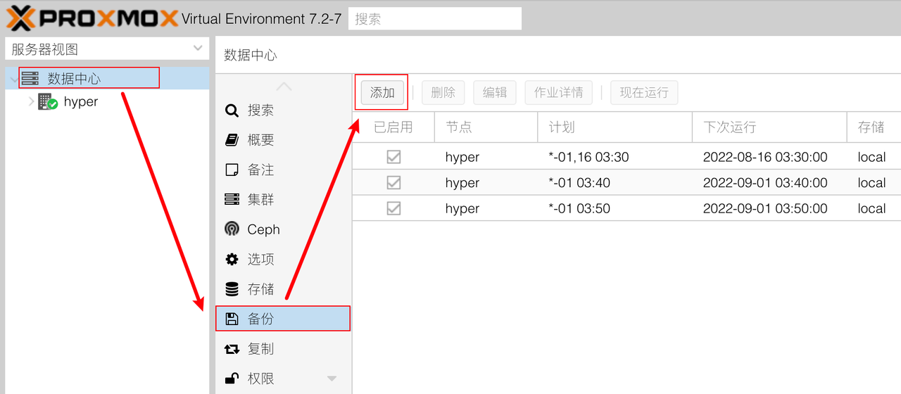
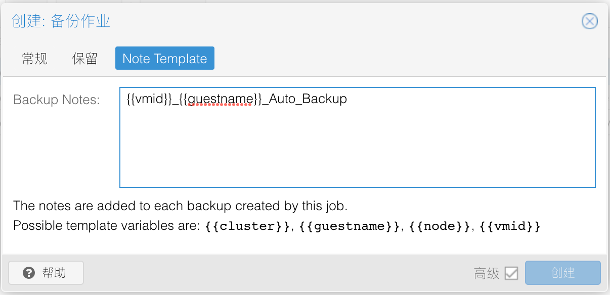

## 1.添加备份作业

在所有虚拟机创建并配置完成后，可以使用 PVE 自带的备份功能周期性的将虚拟机备份。  

点击 PVE 的 `数据中心` ，在右侧菜单中选择 `备份` 功能。  

点击顶部 `添加` 按钮，添加一个备份作业：

### 1.1.备份作业-常规选项

在弹出的 `创建：备份作业` 对话框中，勾选底部的 `Repeat missed` 选项，并修改参数：

|参数|值|说明|
|--|--|--|
|节点|hyper|选择当前 PVE 服务器节点|
|存储|local|选择存放备份文件的路径|
|计划|`*-01,16 03:30`|备份作业执行的时间计划|
|选择模式|包括选中的VMs|执行备份的虚拟机对象|
|发送邮箱至|your_email@qq.com|备份作业邮件收件人邮箱|
|电子邮件|仅在失败时|何时发送备份作业邮件提醒|
|压缩|ZSTD|选择备份文件的压缩算法|
|模式|停止|选择备份虚拟机的方式，推荐使用 `停止` |
|启用|勾选|表示该备份作业为启用状态|
|Job Comment|`Backup Main Router`|备份作业的备注信息，使用英文输入|
|Repeat missed|勾选|表示当意外错过备份执行时间后，将重试备份|

在下方虚拟机列表中，勾选备份作业需要备份的虚拟机（可多选）：

 **说明：**  

计划中的 `*-01,16 03:30` 表示每个月的 1、16 日凌晨 03:30 进行备份作业。  

PVE 在正确配置邮件发送功能之前，并不能发出邮件。  

`停止` 模式表示备份时会将虚拟机关机，备份完成后再自动开机。

### 1.2.备份作业-保留选项

该选项将控制备份文件的保留个数，选择保留最近 3 次的备份文件：

### 1.3.备份作业-Note Template

该选项将按照设置的内容，自动重命名备份文件。  

在 Backup Notes 右侧文本框中输入 `{{vmid}}_{{guestname}}_Auto_Backup` ：

点击 `创建` 按钮，备份作业创建完成。

## 2.调度模拟器

在创建完成备份作业后，可以使用 `调度模拟器` 来模拟备份作业的执行时间。  

鼠标 **单击** 选中一个备份作业，点击右上角的 `调度模拟器` ：

`计划` 处将显示 `备份作业` 的执行时间参数，点击 `模拟` 按钮，在右侧将显示模拟的时间结果：

确认备份作业的执行时间周期是否符合预期。