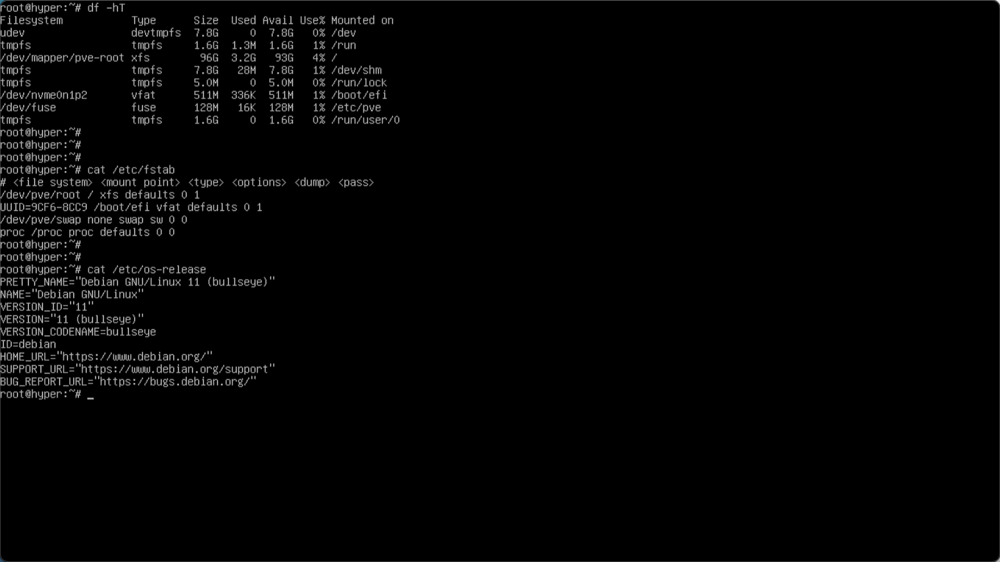
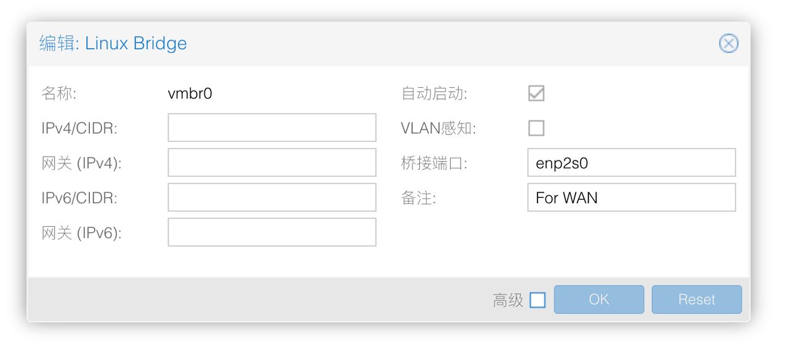
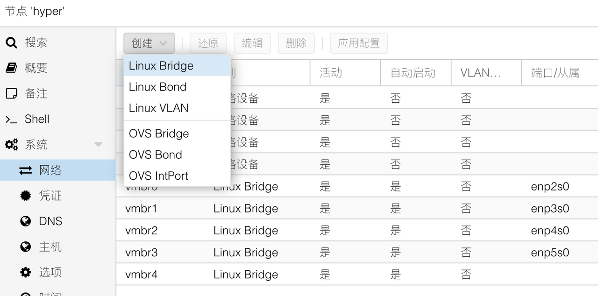
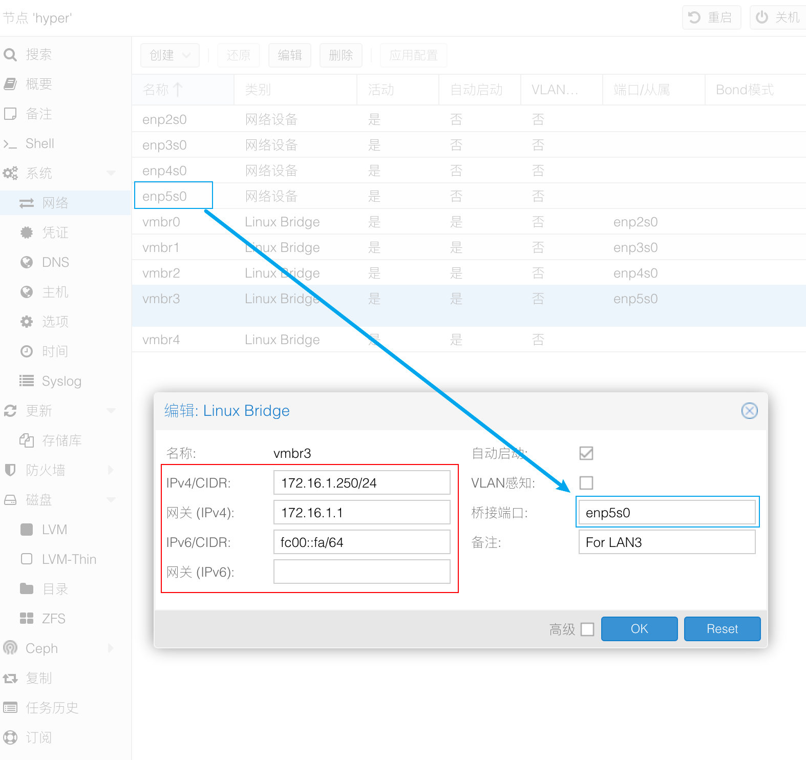
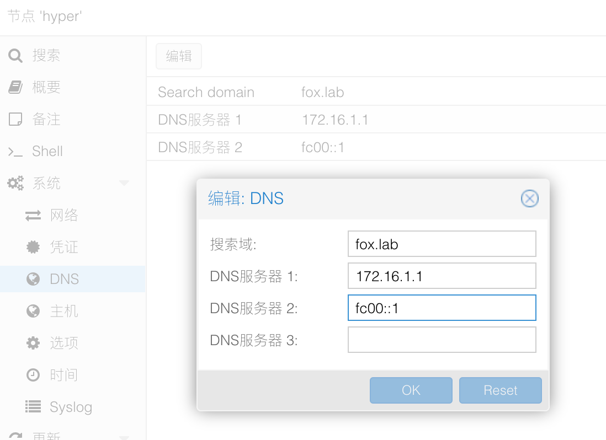

## 1.更换系统软件源

在上一篇文章 [1.PVE系统安装](./1.PVE系统安装.md) 中，我们从刚装好的 PVE 系统中获取了系统的一些参数：



此处显示出 PVE 底层使用的是 Debian 的系统，代号为 `bullseye` 。  

为了后续能够对 PVE 系统进行升级，需要更换其镜像仓库，也就是大家熟知的软件源。  

由于我们目前处于 **“离线”** 安装状态，因此更换完软件源后，在没有网络的情况下无法对系统更新。  

### 1.1.系统软件源替换

使用 SSH 工具登录到 PVE 服务器，首先对现有的软件源配置进行备份：

```bash
## 进入系统软件源配置文件目录
cd /etc/apt

## 将默认软件源配置文件进行备份
cp sources.list sources.list.bak 
```

这里我将使用 [中国科技大（USTC）](http://mirrors.ustc.edu.cn/help/proxmox.html) 的镜像仓库进行替换，使用如下命令：  

 **注意：该命令为两行，在输入时请逐行输入并回车执行** 

```bash
## 替换系统软件仓库

sed -i 's|^deb http://ftp.debian.org|deb https://mirrors.ustc.edu.cn|g' /etc/apt/sources.list

sed -i 's|^deb http://security.debian.org|deb https://mirrors.ustc.edu.cn/debian-security|g' /etc/apt/sources.list

```

执行完成后，检查是否执行正确：  

```bash
## 输出系统源配置文件，检查是否正确
cat /etc/apt/sources.list
```

如果输出结果中有 USTC 的镜像地址，则表示命令已经正确执行。  

如果希望能更新 CPU 的 `microcode` ，则需要手动添加镜像的 `non-free` 参数，完整系统源示例如下：

```bash
deb https://mirrors.ustc.edu.cn/debian bullseye main contrib non-free

deb https://mirrors.ustc.edu.cn/debian bullseye-updates main contrib non-free

# security updates
deb https://mirrors.ustc.edu.cn/debian-security bullseye-security main contrib non-free
```

此处我放出 Debian Bullseye 的完整镜像源以供参考， **非常不建议** 将 PVE 的系统源替换成完整的 Debian 源，以避免系统故障。

```bash
## Debian Bullseye 完整源 （USTC）

deb https://mirrors.ustc.edu.cn/debian/ bullseye main contrib non-free
# deb-src https://mirrors.ustc.edu.cn/debian/ bullseye main contrib non-free

deb https://mirrors.ustc.edu.cn/debian/ bullseye-updates main contrib non-free
# deb-src https://mirrors.ustc.edu.cn/debian/ bullseye-updates main contrib non-free

deb https://mirrors.ustc.edu.cn/debian/ bullseye-backports main contrib non-free
# deb-src https://mirrors.ustc.edu.cn/debian/ bullseye-backports main contrib non-free

deb https://mirrors.ustc.edu.cn/debian-security/ bullseye-security main contrib non-free
# deb-src https://mirrors.ustc.edu.cn/debian-security/ bullseye-security main contrib non-free
```

可以看到，PVE 的系统源和 Debian 完整源的差异在于 `non-free` 和 `bullseye-backports` 。  

如果小伙伴在一些软件或者驱动（比如闭源 GPU 驱动）上遇到麻烦，才需尝试 Debian 的完整镜像源。  

### 1.2.PVE 订阅源替换

默认情况下，PVE 启用了一个官方的源，而该源为订阅制收费，我们需要替换为免费的源。  

进入订阅源的目录：

 **注意：rm 命令为高危险操作命令，请正确使用，请勿手抖，请勿手抖** 

```bash
## 进入订阅源目录
cd /etc/apt/sources.list.d

## 删除该目录下的所有配置
rm -rvf *.list
```

创建 PVE 免费源：  

 **注意：该命令为两行，在输入时请逐行输入并回车执行**   

```bash
## 创建 PVE 免费源

source /etc/os-release

echo "deb https://mirrors.ustc.edu.cn/proxmox/debian/pve $VERSION_CODENAME pve-no-subscription" > /etc/apt/sources.list.d/pve-no-subscription.list

```

创建完成后对其进行检查：

```bash
## 检查PVE免费源
cat /etc/apt/sources.list.d/pve-no-subscription.list 
```

如果输出结果中有 USTC 的镜像地址，则表示命令已经正确执行：

```bash
## 输出内容参考：
deb https://mirrors.ustc.edu.cn/proxmox/debian/pve bullseye pve-no-subscription     
```

### 1.3.PVE CT Templates 替换

如果需要使用 Proxmox 网页端下载 CT Templates，可以替换 CT Templates 的源。  

该功能我未使用，因此只做记录：  

```bash
## 替换 CT Templates 源

cp /usr/share/perl5/PVE/APLInfo.pm /usr/share/perl5/PVE/APLInfo.pm.bak

sed -i 's|http://download.proxmox.com|https://mirrors.ustc.edu.cn/proxmox|g' /usr/share/perl5/PVE/APLInfo.pm

```

如果修改了 CT Templates 地址，需要重启 PVE 服务器才能生效。

### 1.4.替换后操作

更换完成系统源之后，需要更新系统源的同步：

```bash
## 清理软件包
apt clean && apt autoclean && apt autoremove --purge

## 同步软件源
apt update

## 更新系统
apt dist-upgrade
```

考虑到 **“离线”** 安装时无法同步系统源，因此该步骤可以等到 PVE 中安装好了 RouterOS 软路由或其他路由系统并正确连接 Internet 后再执行。  

或者家庭网络环境中还有一个 `172.16.1.0/24` 网段的，已经连接 Internet 的路由器 A ，将路由器 A 的 LAN 口与 PVE 的管理网口连接，此时 PVE 可访问外网。


## 2.安装必要软件

安装软件前，同样要让 PVE 能够访问外网。  

```bash
## 同步镜像仓库
apt update

## 安装系统软件
apt install htop lm-sensors unzip vim tmux unattended-upgrades apt-listchanges powermgmt-base

## 安装网络工具
apt install iperf iperf3 iftop ethtool

## 安装CPU调度调整工具
apt install cpufrequtils

## 根据CPU厂商安装CPU微码工具
apt install intel-microcode (amd64-microcode)

## 更新 PCI 数据库
update-pciids

```

其中 `unattended-upgrades` 为系统自动更新服务，后续会对其进行配置。  

`cpufrequtils` 为 CPU 调度器的配置工具，后续会对 CPU 调度算法进行调整。  


## 3.配置 PVE 网桥和管理网口

设置电脑的 IP 地址为静态 IP ，IP 地址段与 PVE 的 IP 地址段保持一致。  

用网线将电脑的网口与 PVE 的管理网口，此时应该为编号最小的第一个网口，相连接。  

访问 PVE 的 WEB 管理界面，对 PVE 的网络进行一些调整。  


在设置 PVE 的网络之前，需要对网络内部结构做一个规划。  

在前篇的网络地址段规划时，我们有如下规划内容：  
- PVE IP： `172.16.1.250/24` （IPv6： `fc00::fa/64` ）
- PVE 网关： `172.16.1.1` （IPv6 网关将使用 `Link-Local Address` 自动配置）
- PVE DNS： `172.16.1.1` （IPv6 DNS： `fc00::1` ）

我们预计在 PVE 内部安装 RouterOS 用于主路由，2 个 Adguard Home 虚拟机用于提供内网的 DNS 服务以及去广告，且 RouterOS 需要能让 PVE 自身访问外网。  

因此，在 PVE 中除了创建多个绑定物理网口的虚拟网桥外（具体数量依据物理网口数而定），还需 1 个额外的纯内部网桥。  

先放出 PVE 网桥设置完成后的配置页面：  


在实地考察了 PVE 软路由在弱电箱的摆放位置后，本次决定使用 ETH0 口，也就是第一个物理网口，作为 RouterOS 的拨号网口，ETH3 口作为 PVE 的管理网口。  

在初次登录 PVE 的 WEB 管理后台，并访问网络管理页面时，会发现只有一个 `vmbr0` 。  

该 `vmbr0` 绑定的物理口为列表中的第一个网口，且在 `CIDR` 和 `网关` 处有 IP 地址参数，说明 `vmbr0` 就是目前的管理网口。  

造成该状态的原因是我们在安装 PVE 阶段，选择的网口就是第一个网口，因此我们需要对其进行修改。  

首先我们需要对每个物理网口创建网桥，并对其进行配置修改，在修改完成前， **请不要点击“应用配置”** ，不然会导致 PVE 无法访问。

### 3.1.修改默认网桥 vmbr0

首先双击 `vmbr0` ，进入配置界面：  



删除 `IPv4/CIDR` 和 `网关` 信息，确保 `自动启动` 为勾选状态。  

在备注处填写 `For WAN` ，然后点击 `OK` 按钮。  

### 3.2.物理网口创建网桥

点击左上角的 `创建` 按钮，选择 `Linux Bridge` ：  



因为 `vmbr0` 名称已被使用，因此名称处填写 `vmbr1` ，桥接端口填写顺序的第二个网卡名称，我演示这里为 `enp3s0`。  


确保 `自动启动` 为勾选状态，在备注处填写 `For LAN1` ，点击 `创建` 按钮。  

然后，依次创建所有物理接口的内部网桥，直到最后一个：  



在创建最后一个物理网口的 PVE 网桥时，需要额外配置 `IPv4` 地址和对应的 `网关` 参数。  

`IPv6` 仅需填写地址，无需填写 `网关` 参数。  

在所有物理网口的 PVE 网桥创建完成后，可以点击 `应用配置` 按钮，此时页面会失去连接。  

无需担心，只需要将电脑的网线从 PVE 物理机的第一个网口拔出，并插入到最后一个网口即可。  

如果万一还是无法访问到 PVE，可以尝试使用网线“拔插”方法，挨个测试 PVE 网口的访问情况。  

### 3.3.创建 PVE 纯内部网桥


纯内部网桥的创建方法与创建物理网口的网桥方法基本一致，唯一区别是在 **“桥接端口”处为空** 即可。  

纯内部网桥在没有内部路由的情况下是无法访问的，我这里只有在 RouterOS 安装完成并建立了内部网桥后，才可被访问到；主要作用为通过 RouterOS 给内部其他虚拟机提供外网连接。  

当然内部网桥的作用不仅如此，比如还可以作为内部级联路由的连接器。  

例如安装了 OPNsense 和 RouterOS 两个虚拟机，OPNsense 作为防火墙使用，RouterOS 作为二级路由使用，OPNsense 的 LAN 口需要与 RouterOS 的 WAN 口互通。  

此时如果 OPNsense 和 RouterOS 均使用了绑定物理网口的 PVE 网桥，则需要用网线在 PVE 服务器外面连接两个网口，浪费宝贵的网线不说，还占用了网口，得不偿失。而使用纯内部网桥则可以很好的解决该问题，有了这个纯内部网桥，不论多少个虚拟机使用了该网桥，只要是同网段，都可以相互访问。 


## 4.配置 PVE DNS 服务器

在 PVE 的安装过程中设置了 PVE 服务器的 DNS 地址为 `172.16.1.1` ，但并未设置 DNS 的 IPv6 地址。  

在 PVE 系统的 DNS 设置页面中，新增 DNS 服务器的 IPv6 地址，即主路由的 LAN IPv6 地址：




## 5.后续配置

至此，PVE的初始化配置完成。  

后续将会对 PVE 的一些服务进行配置，例如安全加固、调整 CPU 的调度算法节能省钱、PVE 的自动更新等内容。