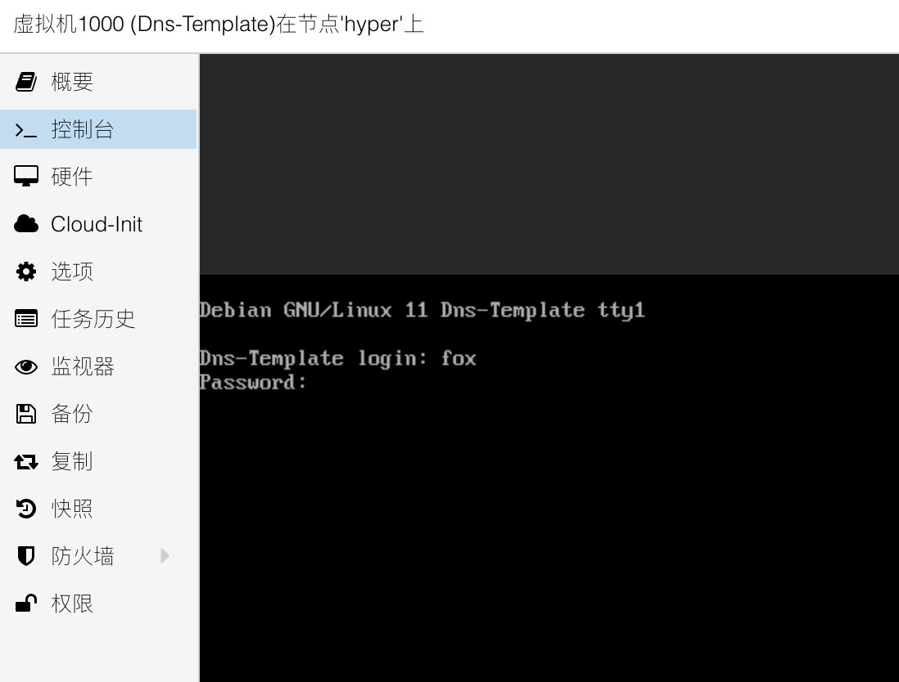
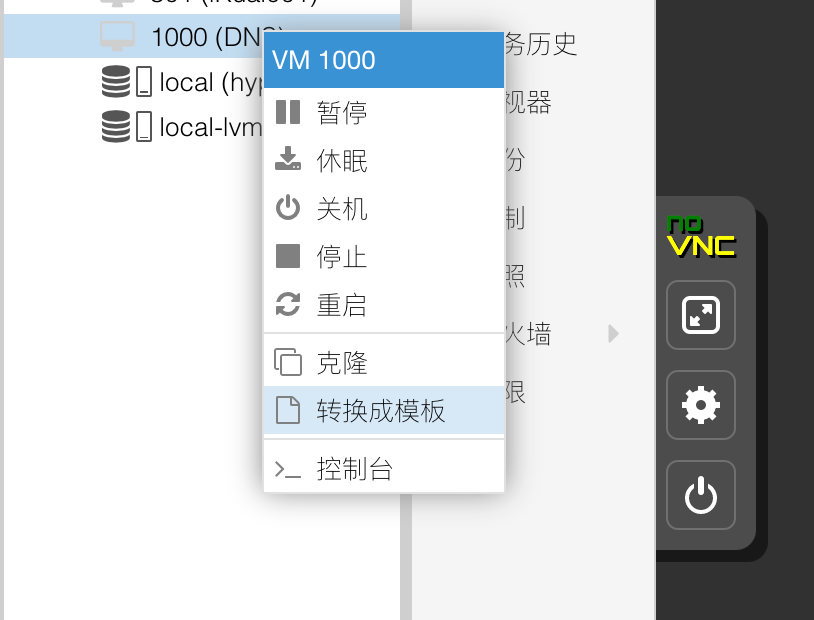

## 1.配置Debian系统

在上一篇文章 [4.PVE创建模板虚拟机](./4.PVE创建模板虚拟机.md) 中，我们已经创建好了用于制作虚拟机模板的 Debian 虚拟机。  

并调整了模板虚拟机的硬件参数、配置参数，但还需对 Debian 系统进行调整。  

此时可以将 Debian 虚拟机开机，并使用 `Cloud-Init` 中设置的账号密码进行登录。  

### 1.1.启用SSH密码登录

因为 Debian 的云镜像默认使用秘钥登录，因此切换到左侧菜单的 `控制台` 进行操作：



在 Debian 虚拟机的命令行界面，使用 `nano` 编辑器编辑 `sshd` 服务的配置文件，执行以下命令：

```bash
## 编辑 ssh 配置文件
sudo nano /etc/ssh/sshd_config.d/fox_sshd.conf
```

在编辑器对话框中输入以下内容，注意命令中间的空格：

```bash
PasswordAuthentication yes

PermitEmptyPasswords no

UseDNS no
```

`nano` 编辑器常用操作如下：
- 在编辑文件时，可以用键盘 `方向键` 移动光标位置
- 在保存文件时，按下键盘 `ctrl 和 x` 组合键，再按下键盘 `y` 键，即可保存

然后，重启 SSH 服务：

```bash
## 重启 sshd
sudo systemctl restart ssh.service
```

就可以像往常一样，通过 SSH 工具远程访问 Debian 虚拟机了。

### 1.2.配置系统软件源

使用 SSH 工具登录 Debian 虚拟机，常用 SSH 工具可以看之前文章中的 [SSH 工具推荐](./1.PVE系统安装.md#03ssh工具) 。  

首先需要对 Debian 系统的软件源进行修改，这里使用 USTC 镜像站作为演示。  

以后当系统版本发生变化时，请参考使用 snullp 大叔开发的 [配置生成器](https://mirrors.ustc.edu.cn/repogen/) 。  

逐条执行以下命令：  

```bash
## 进入系统源配置文件目录
cd /etc/apt/

## 备份旧的系统源配置文件
sudo mv sources.list sources.list.bak

## 创建新的系统源配置文件
sudo nano sources.list
```

在 `nano` 编辑器对话框中输入以下内容（注释了 `deb-src` 以便加快软件源同步速度），并保存：

```bash
deb https://mirrors.ustc.edu.cn/debian/ bullseye main contrib non-free
# deb-src https://mirrors.ustc.edu.cn/debian/ bullseye main contrib non-free

deb https://mirrors.ustc.edu.cn/debian/ bullseye-updates main contrib non-free
# deb-src https://mirrors.ustc.edu.cn/debian/ bullseye-updates main contrib non-free

deb https://mirrors.ustc.edu.cn/debian/ bullseye-backports main contrib non-free
# deb-src https://mirrors.ustc.edu.cn/debian/ bullseye-backports main contrib non-free

deb https://mirrors.ustc.edu.cn/debian-security/ bullseye-security main contrib non-free
# deb-src https://mirrors.ustc.edu.cn/debian-security/ bullseye-security main contrib non-free
```

更新软件源的同步内容，并更新系统，逐条执行以下命令：  

```bash
## 清理不必要的包
sudo apt clean && sudo apt autoclean && sudo apt autoremove --purge

## 更新软件源
sudo apt update

## 更新系统
sudo apt dist-upgrade
```

接下来安装系统必要软件，Adguard Home 将采用 `snap` 形式安装，逐条执行以下命令：  

```bash
## 安装系统软件
sudo apt install qemu-guest-agent zsh git curl htop lm-sensors vim tmux nftables sshguard

## 安装系统自动更新工具
sudo apt install unattended-upgrades apt-listchanges powermgmt-base python3-gi

## 安装网络工具
sudo apt install iperf iperf3 iftop lsof ldnsutils dhcpcd5

## 安装 snap
sudo apt install snapd

## 安装 Adguard Home
sudo snap install adguard-home

## 写入磁盘
sudo sync
```

Adguard Home 安装完成后，先停止其服务：

```bash
## 停止 Adguard Home
sudo snap stop adguard-home
```

### 1.3.配置网卡IPv4

使用 `Cloud-Init` 并给虚拟机分配了静态 IPv4 地址后，虚拟机的网卡还会从路由器的 DHCP 再获取一个 IPv4 地址。  

这个功能在给虚拟机添加网卡设备时很有用，但本 Debian 虚拟机模板的使用场景只需要一个静态 IPv4 地址，因此需要禁用网卡自动获取 IPv4 地址的功能。  

执行以下命令对网卡的配置文件进行修改：

```bash
## 修改 Debian 网卡配置文件
sudo nano /etc/network/interfaces
```

在 `nano` 编辑器对话框中，将 `source-directory /run/network/interfaces.d` 这行内容 “注释” 掉，参考如下内容：

```bash
## 网卡配置文件示例

# Cloud images dynamically generate config fragments for newly
# attached interfaces. See /etc/udev/rules.d/75-cloud-ifupdown.rules
# and /etc/network/cloud-ifupdown-helper. Dynamically generated
# configuration fragments are stored in /run:
# source-directory /run/network/interfaces.d    ## 在这行前面增加注释符 # 来注释
```

将配置保存后，可以将模板虚拟机重启。  

在系统重启完成后，执行以下命令检查系统的 IPv4 地址状态：

```bash
## 检查系统 IP 地址状态
ip a
```

如果系统网卡有且仅有一个 IPv4 地址，且该 IPv4 地址与 `Cloud-Init` 中设置的 IPv4 地址相同，则表示系统网卡已正确设置。  

### 1.4.配置网卡IPv6

使用 `Cloud-Init` 并给虚拟机分配了静态 IPv6 地址后，该地址为私有 ULA 地址，此时虚拟机的网卡不会以 `SLAAC` 的方式配置 IPv6 地址。  

如果上级路由器没有设置 `NAT66` ，且将公网 GUA 地址的 `Prefix` 通告到内网时，虚拟机将无法自动生成 GUA 地址，从而导致无法访问 IPv6 网络。  

因此引入 `dhcpcd` 工具，在正确配置虚拟机 IPv6 地址的同时，保持与 `Cloud-Init` 网卡配置的兼容性。  

执行以下命令对网卡的配置文件进行修改：

```bash
## 备份 dhcpcd 配置文件
sudo mv /etc/dhcpcd.conf /etc/dhcpcd.conf.bak

## 修改 dhcpcd 配置文件
sudo nano /etc/dhcpcd.conf
```

在编辑器对话框中输入以下内容，注意命令中间的空格：

```bash
# This configuration file is customized by fox
# Optimize dhcpcd parameters for dns server

# Only configure IPv6
ipv6only

# Inform the DHCP server of our hostname for DDNS.
hostname

# A list of options to request from the DHCP server.
nooption domain_name_servers, domain_name, domain_search, host_name
option classless_static_routes

# Respect the network MTU.
option interface_mtu

# A ServerID is required by RFC2131.
require dhcp_server_identifier

# Generate Stable Private IPv6 Addresses based from the DUID
slaac private

# Don't send any ARP requests.
noarp
```

保存该配置文件后，重启系统或者执行以下命令重启 `dhcpcd` 服务：  

```bash
## 重启 dhcpcd 服务
sudo systemctl restart dhcpcd.service
```

### 1.5.调整系统内核参数

由于该 Debian 虚拟机模板将用于克隆内网 DNS 服务器，因此需要调整一部分系统内核参数来简单优化性能。  

使用 `nano` 编辑器编辑 **内核参数** 配置文件，执行以下命令：  

```bash
## 编辑 内核参数 配置文件
sudo nano /etc/sysctl.d/99-sysctl.conf
```

在配置文件末尾输入以下内容，注意命令中间的空格：

```bash
# This configuration file is customized by fox
# Optimize system parameters

kernel.panic = 20
kernel.panic_on_oops = 1

net.core.default_qdisc = fq_codel
net.ipv4.tcp_congestion_control = bbr

# Other adjustable system parameters

net.ipv4.conf.all.log_martians = 1

net.ipv4.igmp_max_memberships = 100

net.ipv4.tcp_challenge_ack_limit = 1000
net.ipv4.tcp_fin_timeout = 30
net.ipv4.tcp_keepalive_time = 120
net.ipv4.tcp_max_orphans = 4096
net.ipv4.tcp_max_tw_buckets = 4096
net.ipv4.tcp_syncookies = 1

net.ipv6.conf.all.use_tempaddr = 0
net.ipv6.conf.default.use_tempaddr = 0

```

保存该配置文件后，重启系统或者执行以下命令让配置生效：

```bash
## 让内核参数生效
sudo sysctl -f
```

### 1.6.调整系统时间

默认情况下的 Debian 云镜像的系统时间可能不正确，执行以下命令将系统时区设置为中国时区：

```bash
## 设置系统时区
sudo timedatectl set-timezone Asia/Shanghai
```

设置完成后，执行以下命令检查系统时间：

```bash
## 检查系统时区
date -R
```

Debian 普通镜像常用 `systemd-timesyncd.service` 来同步时间，而 Debian 云镜像使用 `chrony.service` 来同步时间。  

为了使用国内的 NTP 服务器，需要对 `chrony.service` 进行配置。  

执行以下命令对 `chrony` 的配置文件进行修改：

```bash
## 编辑 chrony 配置文件
sudo nano /etc/chrony/chrony.conf
```

在编辑器对话框中，将 `pool 2.debian.pool.ntp.org iburst` 这行内容 “注释” 掉，并添加国内的 NTP 服务器，参考如下内容：

```bash
## chrony 服务配置文件示例

# Use Debian vendor zone.
# pool 2.debian.pool.ntp.org iburst    ## 在这行前面增加注释符 # 来注释

# Use Custom vendor zone.
pool ntp.tencent.com iburst
pool ntp.aliyun.com iburst
```

保存该配置文件后，重启 `chrony` 服务：

```bash
## 重启 chrony 服务
sudo systemctl restart chrony.service
```

再检查系统 NTP 服务器是否被正确修改：

```bash
## 检查系统 NTP 服务器
chronyc sources -V
```

如果输出以下类似内容，则表示系统 NTP 服务设置正确：

```bash
## NTP 服务示例输出

MS Name/IP address         Stratum Poll Reach LastRx Last sample               
===============================================================================
^+ 139.199.215.251               2  10   177   244  -1669us[-1757us] +/-   67ms
^* 203.107.6.88                  2  10   377   105  -1005us[-1094us] +/-   19ms
```

### 1.7.配置系统自动更新

配置 Debian 模板虚拟机的系统自动更新，与配置 PVE 系统自动更新方法基本一致，参阅 [PVE系统自动更新](./3.PVE系统调整.md#5pve系统自动更新) 。  

配置系统更新之前，先检查当前系统定时器状态：

```bash
## 检查系统定时器
sudo systemctl status apt-daily-upgrade.timer
```

配置系统自动更新策略，执行以下命令，使用键盘 `左右方向键` 进行选择，`回车键` 进行确认：

```bash
## 配置自动更新策略
sudo dpkg-reconfigure -plow unattended-upgrades

## 选择 “是” （“YES”）
## 示例输出
Creating config file /etc/apt/apt.conf.d/20auto-upgrades with new version
```

接下来调整 apt 的 `20auto-upgrades` 配置文件：

```bash
## 进入 apt 的配置目录
cd /etc/apt/apt.conf.d

## 编辑 20auto-upgrades 配置文件
sudo nano 20auto-upgrades

## 删除里面全部内容并填写以下内容
APT::Periodic::Update-Package-Lists "1";
APT::Periodic::Unattended-Upgrade "5";
APT::Periodic::AutocleanInterval "1";
APT::Periodic::CleanInterval "1";
```

其中，用来控制系统更新周期的为 `APT::Periodic::Unattended-Upgrade` 这行内容，其中参数 `"5"` 表示更新周期为 `5` 天。  

再调整 apt 的 `50unattended-upgrades` 配置文件，所有修改项目汇聚如下：

```bash
## 进入 apt 的配置目录
cd /etc/apt/apt.conf.d

## 编辑 50unattended-upgrades 配置文件
sudo nano 50unattended-upgrades

## 删除以下行前面的注释符 // ，代表启用
"origin=Debian,codename=${distro_codename}-updates";

## 删除以下行前面的注释符，代表启用，并调整参数
Unattended-Upgrade::AutoFixInterruptedDpkg "true";

Unattended-Upgrade::Remove-Unused-Kernel-Packages "true";

Unattended-Upgrade::Remove-New-Unused-Dependencies "true";

Unattended-Upgrade::Remove-Unused-Dependencies "true";

Unattended-Upgrade::Automatic-Reboot "true";

Unattended-Upgrade::Automatic-Reboot-Time "04:30";
```

因为该配置文件很长，文章中留下一份 Debian 中已配置好的文件 [Fox_Debian_50unattended_Upgrades.conf](./src/Fox_Debian_50unattended_Upgrades.conf) ，以便对比。  

两个配置文件均修改完成后，需要重设系统自动更新触发器，执行以下命令：

```bash
## 重设自动更新触发器时间为凌晨02:00
sudo systemctl edit apt-daily-upgrade.timer

## 根据文件中的提示，在中间空白处填入以下内容
[Timer]
OnCalendar=
OnCalendar=02:00
RandomizedDelaySec=0
```

重启触发器，并检查其状态，执行以下命令：

```bash
## 重启触发器
sudo systemctl restart apt-daily-upgrade.timer

## 再次检查触发器状态
sudo systemctl status apt-daily-upgrade.timer
```

在输出结果中看到系统自动更新的触发时间为凌晨 `02:00` 则表示设置正确。

### 1.8.配置Snap自动更新

先查看 Snap 当前的更新策略，执行以下命令：

```bash
## 显示当前 Snap 自动更新设置
sudo snap refresh --time
```

将 Snap 自动更新时间设置为每天 `2:30-3:30` 和 `14:30-15:30` 两个时间段：

```bash
## 修改 Snap 自动更新时间
sudo snap set system refresh.timer=2:30-3:30,14:30-15:30

## 其他 Snap 自动更新时间设置语法参考
sudo snap set system refresh.timer=mon,2:30,,fri,2:30
```

### 1.9.配置系统定时任务

本步骤为可选操作，主要设置定时重启 Snap 服务以及操作系统。

```bash
## 查看系统定时任务
sudo crontab -l

## 编辑系统定时任务，编辑器选择 nano
sudo crontab -e

## 定时重启 Snap 服务、操作系统
0 5 * * * /usr/bin/snap restart adguard-home
0 6 8,24 * * /usr/sbin/reboot
```

### 1.10.配置ZSH

`Zsh` 是比 `Bash` 好用的 `Shell` 程序，使用 `oh-my-zsh` 进行配置：

```bash
## 返回 home 目录
cd

## 使用 curl 安装 oh-my-zsh
sh -c "$(curl -fsSL https://raw.github.com/ohmyzsh/ohmyzsh/master/tools/install.sh)"

## 或者使用 wget 安装 oh-my-zsh
sh -c "$(wget https://raw.github.com/ohmyzsh/ohmyzsh/master/tools/install.sh -O -)"

## 询问是否切换默认 shell，输入 Y
## 示例输出
Time to change your default shell to zsh:
Do you want to change your default shell to zsh? [Y/n] y
```

### 1.11.清理系统

Debian 模板虚拟机已经配置完成，在将其转换为模板前需要对系统进行清理。  

逐条执行以下命令，注意命令中的空格：

```bash
## 清理系统软件包
sudo apt clean && sudo apt autoclean && sudo apt autoremove --purge

## 清理系统缓存
sudo rm -rvf /var/cache/apt/* /var/lib/apt/lists/* /tmp/*

## 清理系统日志
sudo find /var/log/ -type f | xargs sudo rm -rvf

## 清理命令历史记录文件
rm -rvf ~/.bash_history ~/.zsh_history

## 清理命令历史
history -c
```

## 2.虚拟机转为模板

将 Debian 模板虚拟机关机，并进入 PVE 的 WEB 管理界面。  

在左侧虚拟机列表中，鼠标 **右键单击** Debian 模板虚拟机，在弹出的菜单中选择 `转换成模板` ：



需要说明的是，虚拟机 `转换成模板` 的操作是不可逆的。  

如果某些 Debian 系统的配置项有问题，只能在用该模板克隆出来的新虚拟机中进行修改，或者删除并重新制作模板。  

## 3.额外说明

本文中 Debian 云镜像的系统配置方法大多也适用于 Debian 普通镜像。  

但有关 IP 地址、DNS、系统时区等内容的配置方法在 Debian 普通镜像上有区别。  

而且，如果使用 Debian 普通镜像制作虚拟机模板，建议不要使用 `Cloud-Init` ，以避免某些配置发生变化。

使用 Debian ISO 镜像安装完操作系统后，修改网卡 IP 地址配置，需要执行以下命令：

```bash
## Debian 普通镜像调整网卡配置
sudo vim /etc/network/interfaces
```

在网卡的配置文件中需要修改 `address` 、 `dns-nameservers` 等参数，完整配置文件参考如下：

```bash
# This file describes the network interfaces available on your system
# and how to activate them. For more information, see interfaces(5).

source /etc/network/interfaces.d/*

# The loopback network interface
auto lo
iface lo inet loopback

# The primary network interface
allow-hotplug ens18
iface ens18 inet static
	address 172.16.1.2/24
	gateway 172.16.1.1
	# dns-* options are implemented by the resolvconf package, if installed
	dns-nameservers 172.16.1.3
	dns-search fox.lab
```

检查系统的 `hosts` ，执行以下命令：

```bash
## 检查系统 hosts
cat /etc/hosts

## 示例输出

127.0.0.1	localhost
172.16.1.2	dns001.fox.lab	dns001

# The following lines are desirable for IPv6 capable hosts
::1     localhost ip6-localhost ip6-loopback
ff02::1 ip6-allnodes
ff02::2 ip6-allrouters
```

Debian 普通镜像需要手动修改系统 DNS 配置，执行以下命令：

```bash
## Debian 普通镜像修改系统 DNS
sudo vim /etc/resolv.conf
```

在编辑器对话框中输入以下内容，注意命令中间的空格：

```bash
search fox.lab
nameserver 172.16.1.3
nameserver fc00::3
nameserver 127.0.0.1
```

Debian 普通镜像使用 `systemd-timesyncd.service` 来同步系统时间，检查服务状态：

```bash
## 检查 Debian 普通镜像 NTP 服务器状态
sudo systemctl status systemd-timesyncd.service
```

调整 NTP 服务，逐条执行以下命令：

```bash
## 创建 NTP 配置文件的文件夹
sudo mkdir /etc/systemd/timesyncd.conf.d

## 创建 NTP 配置文件
sudo nano /etc/systemd/timesyncd.conf.d/server_ntp.conf
```

在 nano 编辑器对话框中输入以下内容，并保存：

```bash
[Time]
NTP=ntp.tencent.com ntp.aliyun.com
```

重启 NTP 服务：

```bash
## 重启 NTP 服务
sudo systemctl restart systemd-timesyncd.service
```