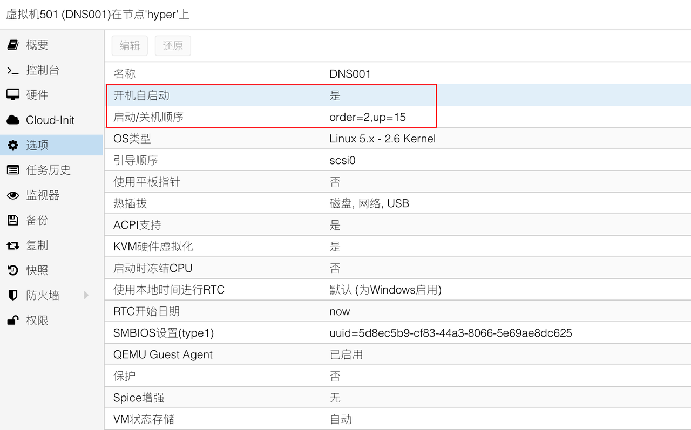
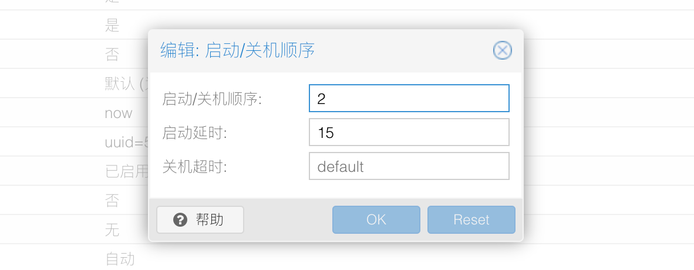

## 1.克隆虚拟机

在上一篇文章 [5.PVE创建模板虚拟机](./5.PVE制作虚拟机模板.md) 中，我们已经制作好了虚拟机模板。  

接下来将使用该模板克隆出新的虚拟机，并使用 Adguard Home 作为内网的 DNS 服务器。  

鼠标 **右键单击** 虚拟机模板，在弹出的菜单中选择 `克隆` ：

在弹出的虚拟机克隆对话框中，根据实际情况及下方表格内容，修改虚拟机参数：

|参数|值|说明|
|--|--|--|
|目标节点|hyper|当前 PVE 服务器节点|
|VM ID|501|可自由定义，不能与现存虚拟机 `VM ID` 相同|
|名称|DNS001|可自由定义，`Cloud-Init` 将使用该名称作为虚拟机 `hostname` |
|模式|完整克隆|选择虚拟机的克隆模式|
|目标存储|local-lvm|克隆出的虚拟机文件存储位置|

参数修改完成后，点击 `克隆` 按钮即可使用该模板克隆出新的虚拟机。

## 2.调整新虚拟机Cloud-Init

克隆出来的虚拟机的 `Cloud-Init` 参数默认与模板完全一致。  

根据之前的网络规划，内网 DNS 服务器 IP 地址分别为：
- `172.16.1.2/24 (fc00::2/64)` 
- `172.16.1.3/24 (fc00::3/64)` 

因此需要调整新虚拟机的 `Cloud-Init` 参数：  

- `DNS服务器` 参数为 `172.16.1.3 fc00::3 127.0.0.1`
- `IP配置` 中的 IPv4 地址参数为 `172.16.1.2/24` ，网关保持 `172.16.1.1` 不变
- `IP配置` 中的 IPv6 地址参数为 `fc00::2/64` ，网关保持为空

这样设置的用意是，让内网两台 DNS 服务器相互提供 DNS 服务。  

但如果内网中仅需一台 DNS 服务器，则 `DNS服务器` 参数可设为本机地址，即 `172.16.1.2 fc00::2 127.0.0.1` 。  

此处需要注意的是，如果修改了 `用户` 参数，相当于新建了一个系统管理员，之前设置的 `oh-my-zsh` 需要在新管理员下重新设置。  

## 3.调整新虚拟机配置参数

在创建模板虚拟机的文章中有提到过，新虚拟机需要修改 [配置参数](./4.PVE创建模板虚拟机.md#3调整虚拟机配置参数) 才能自动启动。  

将新虚拟机的 `开机自启动` 设置为 `是` 。  

鼠标 **双击**  `启动/关机顺序` 选项，调整新虚拟机的自动开机参数：

`启动/关机顺序` 为 `2` ，表示该虚拟机第二个启动，倒数第二个关机。  

`启动延时` 为 `15` ，表示该虚拟机在 PVE 启动完成后，延迟 15 秒自行启动。  

至此，新虚拟机的 IP 地址设置、DNS 设置、自启动设置已经完成。  